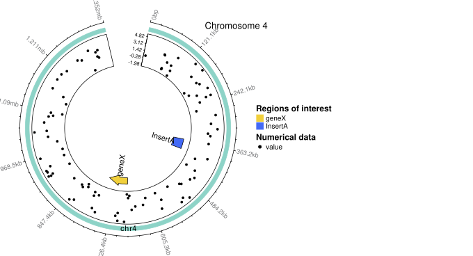

```{r setup, include = FALSE}
library(gmoviz)
library(BiocStyle)
knitr::opts_chunk$set(
  collapse = TRUE,
  comment = "#>"
)
library(knitr)
knitr::opts_chunk$set(fig.width=8, fig.height=5.33, fig.keep='last',
                      message = FALSE, warning = FALSE, dev='jpeg', dpi=150)
opts_knit$set(global.par = TRUE)
```

```{r set_par, include=FALSE}
par(xpd=NA, mar=c(3.1, 2.1, 3.1, 2.1))
```


# Introduction {#advanced_guide}
{width="60%"} 

This vignette will guide you through the more advanced uses of `gmoviz`, such 
as the [incremental apporach to generating plots](#manual_plotting) and
[making finer modifications](#using_circlize). It is **highly recommended** 
that you have read the [basic overview of `gmoviz`](gmoviz_overview.html) 
before this vignette.

# Incremental plotting steps {#manual_plotting}
As well as [high-level functions](gmoviz_overview.html#higher_level) functions, 
`gmoviz` contains many lower-level functions that can be used to construct a 
plot track-by-track for more flexibility.

## Dataset
This section will use the `rBiocpkg("pasillaBamSubset")` package for example
data, so please ensure you have it installed before proceeding:
```{r get-pasilla-bams}
if (!require("pasillaBamSubset")) {
    if (!require("BiocManager"))
        install.packages("BiocManager")
    BiocManager::install("GenomicAlignments")
}
library(pasillaBamSubset)
```

## Initialisation & Ideograms {#initialisation}
The first step in creating a circular plot is to initialise it. This involves
creating the ideogram (the rectangles that represent each sequence), which lays
out the sectors for data to be plotted into. To do this, we need some 
**ideogram data**, in one of the following formats:

* A `GRanges`, with one range for each sector you'd like to plot.
* A `data.frame`, with three columns: `chr` (sector's name), `start` and
    `end`.

For example, the following two ideogram data are equivalent:
```{r two-types-of-ideo}
ideogram_1 <- GRanges(seqnames = c("chrA", "chrB", "chrC"),
                 ranges = IRanges(start = rep(0, 3), end = rep(1000, 3)))
ideogram_2 <- data.frame(chr = c("chrA", "chrB", "chrC"), 
                    start = rep(0, 3),
                    end = rep(1000, 3))
print(ideogram_1)
print(ideogram_2)
```
Both of the higher level functions `featureDiagram` and `insertionDiagram` do
this as their first step.

### Reading in the ideogram data {#get_ideogram}
Of course, typing this manually each time is troublesome. `gmoviz` provides the
function `getIdeogramData` which creates a `GRanges` of the ideogram data
from either a _.bam_ file, single _.fasta_ file or a folder containing many 
_.fasta_ files.[^8] This function can be used as follows:

[^8]: Note that reading in from a _.bam_ file is significantly faster than from
a _.fasta_ file.
```{r getIdeogramData}
## from a .bam file
fly_ideogram <- getIdeogramData(bam_file = pasillaBamSubset::untreated3_chr4())

## from a single .fasta file
fly_ideogram_chr4_only <- getIdeogramData(
  fasta_file = pasillaBamSubset::dm3_chr4())
```

But what if we wanted to read in just the chr3L? Luckily `getIdeogramData` has
filters to select the specific sequences you want.

#### Filtering ideogram data {#get_ideogram_filters}
When reading in the ideogram data from file, there are often sequences in the 
_.bam_ file or _.fasta_ file folder that are not necessary for the plot. Thus,
the `getIdeogramData` function provides three filters to allow you to only
read in the sequences you want.[^9]

[^9]: These filters only work on the `bam_file` and `fasta_folder` input 
methods. Using a `fasta_file` means that filtering is not possible (although
you can of course edit the ideogram GRanges after it is generated).

If we want only a single chromosome/sequence, we can supply it to 
`wanted_chr`:
```{r getIdeogramData_wanted_chr}
getIdeogramData(bam_file = pasillaBamSubset::untreated3_chr4(),
                wanted_chr = "chr4")
```

Alternatively, if we want all chromosomes/sequences expect one, we can supply 
it to `unwanted_chr`:
```{r getIdeogramData_unwanted_chr}
getIdeogramData(bam_file = pasillaBamSubset::untreated3_chr4(),
                unwanted_chr = "chrM")
```

Finally, you can supply any regex pattern to `just_pattern` to create your own
custom filter:
```{r getIdeogramData_just_pattern}
getIdeogramData(bam_file = pasillaBamSubset::untreated3_chr4(),
                just_pattern = "R$")
```

Of course, for these filters to work the spelling of the filter must exactly
match the spelling of the _.fasta_ file names or the sequences in the _.bam_
file.

### Initialising the graph
Now that we have the ideogram data, we can initialise the graph. For this 
example, we will just focus on chromosome 4. 
```{r gmovizInitialise, fig.width=6, fig.height=4}
gmovizInitialise(fly_ideogram_chr4_only, track_height = 0.15)
```

We can see that a rectangle has been plotted and labelled to indicate chr4.
Changing a few visual settings, we can create a better looking ideogram:
```{r gmovizInitialise-pretty, fig.width=6, fig.height=4}
gmovizInitialise(fly_ideogram_chr4_only, 
                 space_between_sectors = 25, # bigger space between start & end 
                 start_degree = 78, # rotate the circle
                 sector_label_size = 1, # bigger label
                 track_height = 0.15, # thicker rectangle
                 xaxis_spacing = 30) # label every 30 degrees on the x axis
```

However, these small tweaks are not the only way we can enhance the appearance
of our plot. `gmovizInitialise` can also display 
[coverage data](#coverage_rectangles) and [labels](#labels), as well as
supporting [zooming and alteration of sector widths](#changing_sector_widths).

#### 'Coverage rectangles' {#coverage_rectangles}
As demonstrated with the `insertionDiagram` and `featureDiagram` functions, we
can supply some `coverage_data` to enhance the ideogram and change the regular
rectangles into line graphs which display the coverage ('coverage 
rectangles'). This then allows the easy identification of deletions, 
duplications and other events which alter the coverage.

##### Reading in coverage data {#get_coverage}
To do this, we must first read in the coverage information from the _.bam_ 
file. This can be done with the `getCoverage` function:
```{r getCoverage}
chr4_coverage <- getCoverage(
  regions_of_interest = "chr4", 
  bam_file = pasillaBamSubset::untreated3_chr4(),
  window_size = 350, smoothing_window_size = 400)
```

Here, we get the smoothed and windowed coverage for chr4.[^10] As we wanted the
coverage for the entire chr4, we could simply make 
`regions_of_interest = "chr4"`. However, we could also have supplied a GRanges
describing that area instead. Whichever input is used, it is really important 
that the sequence names match **exactly**. For example, the following will t
hrow an error, because there is no sequence named "4" or "Chr4" in the _.bam_ 
file:
```{r getCoverage-error, error = TRUE, purl = FALSE}
getCoverage(regions_of_interest = "4", 
            bam_file = pasillaBamSubset::untreated3_chr4(),
            window_size = 300, smoothing_window_size = 400)
getCoverage(regions_of_interest = "Chr4", 
            bam_file = pasillaBamSubset::untreated3_chr4(),
            window_size = 300, smoothing_window_size = 400)
```
[^10]: See below the section on [smoothing and windowing](#smooth_window) 
for the effect of each of these arguments

##### Plotting coverage {#plotting_coverage}
Now that we have the coverage data, we can plot the ideogram again using this
information. To draw a 'coverage rectangle' we need to firstly specifiy the 
`coverage_data` to be used (as either a GRanges or a data frame) and then also 
supply to `coverage_rectangle` a vector of the sector names to plot the 
coverage data for.[^11]

[^11]: This means that you can have the coverage of multiple sequences/regions
in the same GRanges but choose to plot only some of them.

```{r gmovizInitialise-covRect}
gmovizInitialise(ideogram_data = fly_ideogram_chr4_only, 
                 coverage_rectangle = "chr4", 
                 coverage_data = chr4_coverage,
                 xaxis_spacing = 30) 
```
As you can see, the chr4 ideogram rectangle is replaced with a line graph 
showing the coverage over the entire chromosome. The coloured area represents 
the coverage, allowing easy identification of high and low coverage areas. 


##### Smoothing and windowing coverage data {#smooth_window}
When reading in the coverage data, there are two additional parameters
`window_size` and `smoothing_window_size` that modify the values. 

* `window_size` controls the window size over which coverage is calculated 
(where a window size of 1 is per base coverage. A larger window size will 
reduce the time taken to read in, smooth and plot the coverage. It will also 
remove some of the variation in the coverage, although this is not its primary 
aim. If you have more than 10-15,000 points, it is **highly recommended** to 
use a larger window size, as this will take a long time to plot.

* `smoothing_window_size` controls the window used for moving average 
smoothing, as carried out by the `r CRANpkg("pracma")` package. It **does not** 
reduce the number of points and so offers **no speed improvement** (in fact, it 
increases the time taken to read in the coverage data). It does, however, 
reduce the variation to produce a smoother, more attractive plot.

For example, try running the following:
```{r getCoverage-window_size, eval = FALSE}
# default window size (per base coverage)
system.time({getCoverage(regions_of_interest = "chr4", 
                         bam_file = pasillaBamSubset::untreated3_chr4())})

# window size 100
system.time({getCoverage(regions_of_interest = "chr4", 
                         bam_file = pasillaBamSubset::untreated3_chr4(),
                         window_size = 100)})

# window size 500
system.time({getCoverage(regions_of_interest = "chr4", 
                         bam_file = pasillaBamSubset::untreated3_chr4(),
                         window_size = 500)})


```
Notice how going from the default window size of 1 (per base coverage) to a
relatively modest window size of 100 dramatically reduces the time needed to 
read in the coverage data. 

In terms of the appearance of the plot:
(**note:** for speed, we will plot only a subset of the chromosome: from 
70000-72000bp)
```{r smoothing-windowing}
# without smoothing
chr4_region <- GRanges("chr4", IRanges(70000, 72000))
chr4_region_coverage <- getCoverage(regions_of_interest = chr4_region,
                          bam_file = pasillaBamSubset::untreated3_chr4())
gmovizInitialise(ideogram_data = chr4_region, coverage_rectangle = "chr4", 
                 coverage_data = chr4_region_coverage, custom_ylim = c(0,4))

# with moderate smoothing 
chr4_region_coverage <- getCoverage(regions_of_interest = chr4_region,
                          bam_file = pasillaBamSubset::untreated3_chr4(),
                          smoothing_window_size = 10)
gmovizInitialise(ideogram_data = chr4_region, coverage_rectangle = "chr4", 
                 coverage_data = chr4_region_coverage, custom_ylim = c(0,4))

# with strong smoothing
chr4_region_coverage <- getCoverage(regions_of_interest = chr4_region,
                          bam_file = pasillaBamSubset::untreated3_chr4(),
                          smoothing_window_size = 75)
gmovizInitialise(ideogram_data = chr4_region, coverage_rectangle = "chr4", 
                 coverage_data = chr4_region_coverage, custom_ylim = c(0,4))
```
Notice how adding smoothing dramatically improves the appearance of the plot.
It also slightly reduces the time taken, because there are less extreme points.
However, it does result in the loss of the finer detail of the coverage data.
Thus, it is recommended that you play around with the values of 
`smoothing_window_size` and `window_size` and choose a value that is best 
suited to your own data.

#### Adding labels {#labels}
One more functionality of `gmovizInitialise` is the ability to add labels to 
the outside of the plot. These can be used to identify regions of interest, 
such as genes or exons. The format of this should be:

* A `GRanges`, with one range for each label & the label's text as a metadata
column `label`

* A `data.frame`, with columns: `chr` (sector's name), `start` and `end`
that represent the position of the label and `label` that contains the label's
text

For example:
```{r gmovizInitialise-labels}
label <- GRanges(seqnames = "chr4", 
                 ranges = IRanges(start = 240000, end = 280000),
                 label = "region A")
gmovizInitialise(fly_ideogram_chr4_only, label_data = label, 
                 space_between_sectors = 25, start_degree = 78, 
                 sector_label_size = 1, xaxis_spacing = 30)
```
This is the same as how the labels in `insertionDiagram` and `featureDiagram`
are implemented.

These labels can be manually specified as above, or read in from a .gff file,
which also gives the option of colour coding the labels.[^12] :

[^12]: This works simply by supplying a vector of colours (with the same length
as the number of labels) to `label_colour` rather than just a single colour. 
You don't have to have the colours as a part of the label data, it's just a
bit easier to keep track of that way.

```{r labels_from_gff}
labels_from_file <- getLabels(
  gff_file = system.file("extdata", "example.gff3", package = "gmoviz"),
  colour_code = TRUE)
gmovizInitialise(fly_ideogram_chr4_only, 
                 label_data = labels_from_file, 
                 label_colour = labels_from_file$colour,
                 space_between_sectors = 25, start_degree = 78, 
                 sector_label_size = 1, xaxis_spacing = 30)  
```
#### Changing sector sizes {#changing_sector_widths}
By default, when using `gmovizInitialise`, each sector is sized to match its 
length relative to all of the other sectors on the plot to faciliate accurate 
representation of the scale. However, when a plot includes sectors that differ
greatly in size, this can lead to problems. For example:

```{r zooming_ideo}
fly_ideogram <- getIdeogramData(bam_file = pasillaBamSubset::untreated3_chr4(),
                                unwanted_chr = "chrM")
gmovizInitialise(fly_ideogram)
```
Notice that chr4 and chrYHet are much shorter than the other chromosomes.
Thus, when we try to plot it, those three shorter sectors are so small that 
they are barely visible and their labels overlap leading to confusion.

We can deal with this in one of two ways: firstly by manually specifying the
width (size) of each sector and secondly by zooming.

##### Setting custom sector widths
One way to manipulate the width/size of the sectors is to specify a 
`custom_sector_width` (custom sector width) vector. This vector should be the 
same length as the number of sectors. For example:
```{r gmovizInitialise-custom_sector_width}
gmovizInitialise(fly_ideogram, 
                 custom_sector_width = c(0.2, 0.2, 0.2, 0.2, 0.2, 0.1, 0.1))
```
Notice that the `custom_sector_width` vector had length 7, because this is how 
many sectors there are. `custom_sector_width` can also be used for the 
`insertionDiagram` and `featureDiagram` functions in the same way.

##### Zooming {#zooming}
Whilst it is quite easy to set custom sector widths when there are only a few
sectors, it can be quite troublesome for entire genomes. Also, using this 
method loses the relative sizing of all sectors, potentially leading to 
misinterpretation.

We can solve this problem by using the zooming functionality of 
`gmovizInitialise`. Doing this is relatively easy, all we need to do is 
supply the names of sector(s) to zoom to the `zoom_sectors` argument:
```{r gmovizInitialise-zooming-after}
gmovizInitialise(fly_ideogram, zoom_sectors = c("chr4", "chrYHet"),
                 zoom_prefix = "z_")
```
Now, chr4 and chrYHet are clearly visible alongside the rest of the sectors.
Notice that chrYHet is still around 1/4 of the size of chr4, as is expected
from their relative sizes (347038bp and 1351857bp, respectively). Also, all of
the other chromosomes are still proportional. Another advantage of using the
zooming is that the `zoom_prefix` applied to the start of the zoomed sector 
label makes it clear which sectors have been zoomed and which have not.

## Adding tracks {#tracks}
After initialising the graph, the next step is to add tracks containing data.
The two main types of track are the [feature track](#feature_track) and the 
[numeric tracks](#numeric_tracks), which can be combined as desired to create
a customised plot.

### Feature track {#feature_track}
The 'feature' track, plots regions of interest just like the 
[featureDiagram](gmoviz_overview.html#feature_diagram) function (in fact, 
`featureDiagram` is just a convenient combination of `gmovizInitialise` and 
`drawFeatureTrack`). If you only want to plot features, then using 
`featureDiagram` is probably easier, but taking a track-by-track approach with 
`drawFeatureTrack` allows the combination of feature tracks with numeric data 
(see [here](#numeric_tracks) for an example). 

Just like `featureDiagram`, `drawFeatureTrack` requires *feature_data*. See 
[here](gmoviz_overview.html#feature_diagram) for an explanation of the format.

#### Reading in the feature data {#get_features}
Feature data can be read in from a _.gff_ file using the `getFeatures` 
function. 

```{r getFeatures}
features <- getFeatures(
  gff_file = system.file("extdata", "example.gff3", package = "gmoviz"), 
  colours = rich_colours)
```
Here, we have set the `colours` parameter to `rich_colours`, one of the five
colour sets provided by `gmoviz` (see [here](#colours) for a description of 
each colour set) This means that the features will be allocated a colour from 
this set based on the 'type' field of the _.gff_ file.

Once the feature data is read in, it is highly recommended to take a look and
tweak it, if necessary.

#### Adding a feature track
Once we have the feature data, we can add a feature track to our plot. As we 
are only adding one track, increasing `track_height` to 0.18 gives us a bit 
more room to draw the features.
```{r drawFeatureTrack}
## remember to initialise first
gmovizInitialise(fly_ideogram_chr4_only, space_between_sectors = 25, 
                 start_degree = 78, xaxis_spacing = 30, sector_label_size = 1)
drawFeatureTrack(features, feature_label_cutoff = 80000, track_height = 0.18)
```
Notice that the _geneY_ label was drawn inside the arrow whilst the others were
drawn further into the circle. This is because we set `feature_label_cutoff` to
80000, so any features less than 80000bp long have their labels drawn outside,
so that the label isn't hanging off the end of the feature. See below for a 
detailed discussion of this concept.

#### Label plotting and cutoffs for features {#feature_labels}
When using the `featureDiagram` and `drawFeatureTrack` functions, you
may have noticed that the position of the labels changes based on the size of 
the feature being plotted. For example, in the following plot, the second 'ins'
label is drawn outside the feature, further towards the centre of the circle.
This is because the size of the feature is less than the 
`feature_label_cutoff`.
```{r feature_label_cutoff}
## the data
plasmid_ideogram <- GRanges("plasmid", IRanges(start = 0, end = 3000))
plasmid_features <- getFeatures(
  gff_file = system.file("extdata", "plasmid.gff3", package="gmoviz"),
  colour_by_type = FALSE, # colour by name rather than type of feature
  colours = rich_colours) # choose colours from rich_colours (see ?colourSets)

## the plot
featureDiagram(plasmid_ideogram, plasmid_features, track_height = 0.17)
```

Of course, you can specify your own cutoff. At 1, all labels will be plotted 
inside their respective features. 
```{r change_label_cutoff}
## smallest label cutoff
featureDiagram(plasmid_ideogram, plasmid_features, track_height = 0.17,
               feature_label_cutoff = 1)
```


### Numeric data tracks {#numeric_tracks}
As well as the feature track, `gmoviz` also contains more traditional numeric
data tracks: the scatterplot and the line graph. 

To showcase these tracks, we will generate some example data:
```{r numeric_data}
numeric_data <- GRanges(seqnames = rep("chr4", 50),
                       ranges = IRanges(start = sample(0:1320000, 50),
                                        width = 1),
                       value = runif(50, 0, 25))
```

Scatterplot tracks can be plotted with `drawScatterplotTrack` and line graphs
with `drawLinegraphTrack`:
```{r numeric_data_plots}
## remember to initialise first
gmovizInitialise(fly_ideogram_chr4_only, 
                 space_between_sectors = 25, start_degree = 78, 
                 sector_label_size = 1, xaxis_spacing = 30)
## scatterplot
drawScatterplotTrack(numeric_data)

## line graph
drawLinegraphTrack(sort(numeric_data), gridline_colour = NULL)
```
Note that for the line graph track, the data should be sorted in ascending 
order before plotting.

These numeric tracks can then be combined with feature tracks, as desired:
```{r numeric_data_with_features, fig.height=8, fig.width=12}
gmovizInitialise(fly_ideogram_chr4_only, space_between_sectors = 25, 
                 start_degree = 78, xaxis_spacing = 30, sector_label_size = 1)
drawScatterplotTrack(numeric_data, track_height = 0.14, yaxis_increment = 12)
drawFeatureTrack(features, feature_label_cutoff = 80000, track_height = 0.15)
```

## Finishing touches {#finishing_touches}
### Legends {#legends}
Like `r CRANpkg("circlize")`, `gmoviz` relies on the package 
`r Biocpkg("ComplexHeatmap")` [@Gu_2016] to generate its legends. More 
information about how this works can be found 
[here](https://jokergoo.github.io/circlize_book/book/legends.html), but for 
simplicity, `gmoviz` provides the `makeLegends` function to create legend 
objects without requiring an understanding of how the `ComplexHeatmap` package 
works. 

Here, we will make a legend for the plot shown just previously. 
```{r makeLegends}
legend <- makeLegends(
    feature_legend = TRUE, feature_data = features, 
    feature_legend_title = "Regions of interest", scatterplot_legend = TRUE,
    scatterplot_legend_title = "Numeric data", 
    scatterplot_legend_labels = "value")
```

`legend` is a legend object that can be plotted alongside a circos plot using
the `gmovizPlot` function:

### Arranging legends alongside plots {#arranging}
As explained [here](https://jokergoo.github.io/circlize_book/book/legends.html)
the legends of `ComplexHeatmap` are generated using grid graphics whilst the 
circular plots of `circlize` use base graphics. Thus, combining the two 
requires the use of the `r CRANpkg("gridBase")` package. More information can 
be found at the aforementioned link, but `gmoviz` provides the `gmovizPlot` 
function to conveniently combine these two elements. 

The `gmovizPlot` function generates a plot based on the code supplied to the 
`plotting_functions` parameter and saves it as an image, alongside and optional 
title and legend. [^13]

[^13]: The legend object can be either one generated using `makeLegends` or 
directly made using the functionality of the `ComplexHeatmap` package.

```{r gmovizPlot}
gmovizPlot(file_name = "example.svg", file_type = "svg", 
           plotting_functions = {
    gmovizInitialise(
        fly_ideogram_chr4_only, space_between_sectors = 25, start_degree = 78,
        xaxis_spacing = 30, sector_label_size = 1)
    drawScatterplotTrack(
        numeric_data, track_height = 0.14, yaxis_increment = 12)
    drawFeatureTrack(
        features, feature_label_cutoff = 80000, track_height = 0.15)
}, legends = legend, title = "Chromosome 4", background_colour = "white",
width = 8, height = 5.33, units = "in")
```



`gmovizPlot` also supports .svg and .ps outputs, as well as .png. Using a 
vectorised output (.svg or .ps) is recommended as it allows you to easily edit 
the plot in Illustrator or similar software.

# Other features and hints
## `gmoviz` colour sets {#colours}
Often 20+ sectors will be plotted during the initialisation of an entire 
genome. Thus, `gmoviz` includes five different colour sets each containing 34 
colours in order to make it easier to give each of these sectors a unique, 
beautiful colour. Many of the colours in these sets are from or are heavily 
inspired by 
[colorBrewer](http://colorbrewer2.org/#type=sequential&scheme=BuGn&n=3). 
The colour sets are:

* `nice_colours`: The default colour set. Medium brightness, light colours 
designed for use on a white background.

* `pastel_colours`: A set of subdued/pastel colours (a less saturated version 
of the `nice_colours` set), designed for use on a white backgorund.

* `rich_colours`: A set of bright, vibrant colours (though not neon, like the 
`bright_colours_transparent`) designed for use on both white and black 
backgrounds.

* `bright_colours_transparent`: A set of very bright/neon colours 
**with slight transparency** designed for use on a black background. 

* `bright_colours_opaque`: A set of very bright/neon colours 
**without transparency** designed for use on a black background. 

Using `bright_colours_transparent` as the fill and `bright_colours_opaque` as 
the outline gives a nice effect on black backgrounds.

## Adding to plots using circlize functions {#using_circlize}
As mentioned, `gmoviz` is based on the `r CRANpkg("circlize")` [@Gu_2014] 
package by Zuguang Gu. Thus, `circlize` functions can be used alongside those 
from `gmoviz` to further customise plots. 

Internally, `gmoviz` calls `circos.clear()` **when initialising plots** (at the 
beginning of the `gmovizInitialise`, `featureDiagram` and `insertionDiagram` 
functions) not at the end of functions. This means that, after you have run a 
`gmoviz` plotting function, you can use any `circlize` function to make 
further additions to the plot. 
For an example, we will further annotate the `insertionDiagram` plot produced
in the basic overview vignette [here](gmoviz_overview.html#insertion_diagram):
```{r circlize_annotation}
## the data
example_insertion <- GRanges(seqnames = "chr12",
                      ranges = IRanges(start = 70905597, end = 70917885),
                      name = "plasmid", colour = "#7270ea", length = 12000,
                      in_tandem = 11, shape = "forward_arrow")

## the original plot
insertionDiagram(example_insertion, either_side = c(70855503, 71398284),
                 start_degree = 45, space_between_sectors = 20)

## annotate with text
circos.text(x = 81000, y = 0.25, sector.index = "plasmid", track.index = 1, 
            facing = "bending.inside", labels = "(blah)", cex = 0.75)

## annotate with a box
circos.rect(xleft = 0, xright = 12000, ytop = 1, ybottom = 0, 
            track.index = 2, sector.index = "plasmid", border = "red")
```
Of course, use of `circlize` functions is not just limited to small 
annotations. Functions such as `circos.trackPlotRegion()` and `circos.track()` 
can be used to add additional tracks to plots generated with `gmoviz` and 
likewise the `gmoviz` track functions (*e.g.* `drawFeatureTrack`) can be used
to add to plots previously generated with `circlize`. For more information 
about using `circlize`, see the comprehensive book
[here](https://jokergoo.github.io/circlize_book/book/)

**Warning:** this also means that if you want to use `circlize` to generate a 
new plot after using `gmoviz`, you will need to use `circos.clear()` to reset.

# Session Info {-}
This vignette was rendered in the following environment:
```{r gmoviz_session_info, echo = FALSE}
sessionInfo()
```

# References {-}
