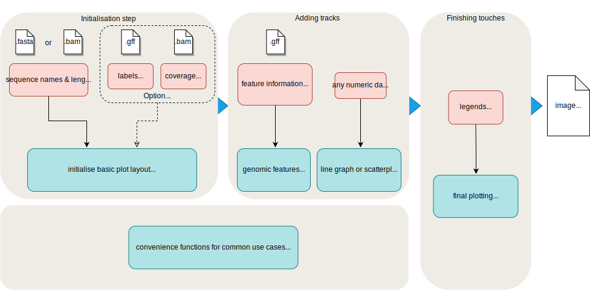

```{r setup, include = FALSE}
library(gmoviz)
library(BiocStyle)
knitr::opts_chunk$set(
  collapse = TRUE,
  comment = "#>"
)
library(knitr)
knitr::opts_chunk$set(fig.width=8, fig.height=5.33, fig.keep='last',
                      message = FALSE, warning = FALSE, dev='jpeg', dpi=150)
opts_knit$set(global.par = TRUE)
```

```{r set_par, include=FALSE}
par(xpd=NA, mar=c(3.1, 2.1, 3.1, 2.1))
```


# Introduction 
{width="60%"} 

Genetically modified organisms (GMOs) and cell lines are widely used models in 
many aspects of biological research. As part of characterising these models, 
DNA sequencing technology and bioinformatic analyses are used systematically to 
study their genomes. Large volumes of data are generated and various algorithms 
are applied to analyse this data, which introduces a challenge with regards to 
representing all findings in an informative and concise manner. Scientific 
visualisation can be used to facilitate the explanation of complex genomic 
editing events such as intergration events, deletions, insertions, etc. 
However, current visualisation tools tend to focus on numerical data, ignoring 
the need to visualise editing events on a large yet biologically-relevant 
scale. 

`gmoviz` is an R package designed to extend traditional bioinformatics 
workflows used for genomic characterisation with powerful visualisation 
capabilities based on the Circos [@Krzywinski_2009] plotting 
framework, as implemented in `r CRANpkg("circlize")` [@Gu_2014]. `gmoviz` 
offers the following key features (summarised in the diagram below):

* Visualise complex structural variations, particularly relating to tandem
insertions 

* Generate plots in a single function call, or build them piece by piece for 
finer customisation

* Integration with existing Bioconductor data structures

 

## How to read Circos plots
Circos plots have two key components: sectors and tracks. Each sector 
represents a sequence of interest (such as a chromosome, gene or any other 
region). Tracks on the other hand are used to display data. For example:
```{r sectors-tracks-figure, echo=FALSE, fig.keep='high'}
example_insertion <- GRanges(seqnames = "chr12",
                      ranges = IRanges(start = 70905597, end = 70917885),
                      name = "plasmid", colour = "#7270ea", length = 12000,
                      in_tandem = 11, shape = "forward_arrow")
layout(matrix(c(1,2), nrow=1, ncol=2))
insertionDiagram(insertion_data = example_insertion, 
                 either_side = c(70855503, 71398284),
                 start_degree = 45, space_between_sectors = 20,
                 xaxis_spacing = 45)
highlight.sector("chr12", col = NA, border = "red", lwd = 1.5)
highlight.sector("plasmid", col = NA, border = "red", lwd = 1.5)

insertionDiagram(insertion_data = example_insertion, 
                 either_side = c(70855503, 71398284),
                 start_degree = 45, space_between_sectors = 20,
                 xaxis_spacing = 45)
draw.sector(start.degree = 0, end.degree = 360,
            0.99, 0.84, border = "blue", lwd = 1.5)
draw.sector(start.degree = 0, end.degree = 360,
            0.84, 0.69, border = "blue", lwd = 1.5)
```
In the figure above, red boxes have been drawn around each of the sectors. In
the next panel, blue boxes have been drawn around each of the tracks

# Installation
`gmoviz` can be installed from [bioconductor.org](http://bioconductor.org/) or
its [GitHub repository](https://github.com/malhamdoosh/gmoviz)

## Bioconductor
To install `gmoviz` via the `BiocManager`, type in R console:
```r
if (!require("BiocManager"))
    install.packages("BiocManager")
BiocManager::install("gmoviz")
```

## GitHub
To install the development version of `gmoviz` from GitHub, type in the R 
console:
```r
if (!require("BiocManager"))
    install.packages("BiocManager")
BiocManager::install("malhamdoosh/gmoviz")
```

## R package dependencies
`gmoviz` depends on several packages from the 
[CRAN](https://cran.r-project.org/) and 
[Bioconductor](https://bioconductor.org/) repositories:

* `r CRANpkg("circlize")` provides the lower-level functions used to generate
the circular plots. To install it, type in the R console: 
`install.packages("circlize")`

* `r Biocpkg("GenomicRanges")` and `r Biocpkg("IRanges")` are required for the 
GRanges data structure that is used to store information for plotting. To 
install them, type in the R console: 
```r
if (!require("BiocManager"))
    install.packages("BiocManager")
BiocManager::install(c("GenomicRanges", "IRanges"))
```

* `r CRANpkg("gridBase")` faciliates the use of the circular plots (which are
generated using base graphics) with the grid graphics system. To install it, 
type in the R console:
`install.packages("gridBase")`

* `r Biocpkg("ComplexHeatmap")` is used to generate legends. To install it, 
type in the R console:
```r
if (!require("BiocManager"))
    install.packages("BiocManager")
BiocManager::install("ComplexHeatmap")
```

* `r Biocpkg("Rsamtools")` is used to read information about the sequence
names, lengths and coverage from _.bam_ files. To install it, type in the R 
console: 
```r
if (!require("BiocManager"))
    install.packages("BiocManager")
BiocManager::install("Rsamtools")
```

* `r Biocpkg("Biostrings")` is used to read information about the sequence
names and lengths from _.fasta_ files. To install it, type in the R console: 
```r
if (!require("BiocManager"))
    install.packages("BiocManager")
BiocManager::install("Biostrings")
```

* `r Biocpkg("rtracklayer")` is used to read information on genomic features 
from _.gff_ files. To install it, type in the R console: 
```r
if (!require("BiocManager"))
    install.packages("BiocManager")
BiocManager::install("rtracklayer")
```

* `r CRANpkg("pracma")` is used to apply moving-average smoothing to the 
coverage data. To install it, type in the R console: 
`install.packages("pracma")`

* `r Biocpkg("BiocGenerics")` is used to support the many Bioconductor data
structures and functions used in `gmoviz` To install it, type in the R console: 
```r
if (!require("BiocManager"))
    install.packages("BiocManager")
BiocManager::install("BiocGenerics")
```
* `r Biocpkg("GenomeInfoDb")` and `r Biocpkg("GenomicAlignments")` are used to 
read in the coverage data from _.bam_ files. To install them, type in the 
R console: 
```r
if (!require("BiocManager"))
    install.packages("BiocManager")
BiocManager::install(c("GenomeInfoDb", "GenomicAlignments"))
```

# Quick start {#quick_start}
This section will walk through the basic usage of `gmoviz`. For more advanced
usage, such as the incremental apporach to generating plots and making
finer modifications, please see the advanced guide [here](gmoviz_advanced.html). 

## Higher-level plotting steps {#higher_level}
### Insertion diagram {#insertion_diagram}
`insertionDiagram` is the 'star' function of `gmoviz`, designed to make it 
easier to plot (and thus show the copy number of) tandem insertion events. 
It requires only one input: insertion_data (either a GRanges or a data frame)
with the following columns.[^1] :

[^1]: If using a GRanges these should be the metadata columns and each range
should correspond to the start/end of the insertion site. For data frame input,
use the columns `chr`, `start` and `end` to describe the insertion site's
location. 

* **name** A character string indicating the name of the insert. Each insert 
must have a unique name. 

* **colour** A character string of a colour to use. Supports hex colours like
`#000000` and named R colours like `red`

* **shape** The shape that will be used to represent the insert:
  + `rectangle` is a rectangle (the default)
  + `forward_arrow` is a forwards-facing arrow
  + `reverse_arrow` is a backwards (reverse) facing arrow

* **length** The length **of a single copy** of the insert, **in bp**

* **in_tandem** The number of tandem copies of the insert (defaults to 1 if not
supplied)

Note that _in\_tandem_, _shape_ and _colour_ are all optional: if any of
these columns are not supplied the inserts will still be plotted and default
values will be allocated.

`insertionDiagram` will plot the tandem insert(s) on one sector, and use a 
'link' to show the position they have inserted into in their target 
sequence (the other sector).[^2] :

[^2]: A link is a semi-transparent shape which connects two sectors in the
circle. It is very useful for demonstrating insertion events, or to indicate
zooming into a particular part of the sector.

```{r cnd-style1}
example_insertion <- GRanges(seqnames = "chr12",
                      ranges = IRanges(start = 70905597, end = 70917885),
                      name = "plasmid", colour = "#7270ea", length = 12000,
                      in_tandem = 11, shape = "forward_arrow")
insertionDiagram(insertion_data = example_insertion, 
                 space_between_sectors = 20, xaxis_spacing = 45)
```
The above diagram shows the insertion of 11 tandem copies of 'plasmid' at the
site chr12:70905597-70917885. 

#### Alternate styles 
There are four different styles of `insertionDiagram`: above was style 1: the
emphasis was placed on the inserted sequence(s) and a rectangle was drawn for
the inserted sequences to highlight that they are inserted as one long tandem
group.

The same diagram can be plotted with the emphasis on the target sequence
**(style 2)**:
```{r cnd-style2}
insertionDiagram(example_insertion, space_between_sectors = 20, style = 2)
```
Notice how the target sequence (chr12) is now larger than the inserted sequence

Additionally, the rectangle outside of the inserted sequences can be removed,
using styles 3 and 4 (which, like styles 1 and 2 differ only in the relative
sizes of the target and inserted sequences)

Styles 3 & 4 are recommended for single-copy insertions, like the following:
```{r cnd-singleins-style34, fig.keep='high'}
single_copy_insertion <- GRanges(seqnames = "chr12",
                       ranges = IRanges(start = 70905597, end = 70917885),
                       name = "plasmid", length = 12000)
insertionDiagram(single_copy_insertion, space_between_sectors = 20, style = 3)
insertionDiagram(single_copy_insertion, space_between_sectors = 20, style = 4)
```
Notice how we were able to omit the `in_tandem`, `colour` and `shape` columns 
from the insertion data, because we were happy with the default values.

#### Multiple insertion sites
Additionally, the `insertionDiagram` is capable of showing multiple integration
sites. To do this, simply add another row to the insertion data:
```{r cnd-multiple}
multi_insertions <- GRanges(seqnames = "chr12",
                       ranges = IRanges(start = 70910000, end = 70920000),
                       name = "plasmid2", length = 10000)
multiple_insertions <- c(single_copy_insertion, multi_insertions)

## plot it
insertionDiagram(multiple_insertions)
```
Note that adding multiple insertion sites across different chromosomes using
`insertionDiagram` is currently **not** supported; it simply becomes too messy 
and crowded on a single circle. If you are interested in showing many 
insertions throughout the genome, please see the `multipleInsertionDiagram`
function [here](#aobf) which uses multiple circles to avoid this problem

#### Adding more information {#cnd_more_info}
The `insertionDiagram` function (and also the `featureDiagram` function which 
works in a similar way) is also able to accept two optional inputs: labels 
(for example to indicate genes, exons or other genomic regions of interest) 
and coverage data.[^3] This section will explain how to add this information 
to a plot.

[^3]: more information on adding labels to plots including colour coding and 
reading in label data from file can be found 
[here](gmoviz_advanced.html#labels).

Firstly, labels:
```{r cnd-labels, fig.height=8, fig.width=12}
nearby_genes <- GRanges(seqnames = c("chr12", "chr12"),
                        ranges = IRanges(start = c(70901000, 70911741),
                                         end = c(70910000, 70919000)),
                        label = c("Gene A", "Gene B"))
insertionDiagram(insertion_data = example_insertion, 
                 label_data = nearby_genes,
                 either_side = nearby_genes, 
                 space_between_sectors = 20,
                 xaxis_spacing = 75, # one x axis label per 75 degrees
                 label_size = 0.8, # smaller labels so they fit
                 track_height = 0.1) # smaller shapes so the labels fit
```
The labels for genes A and B have now been plotted on the insertion diagram.
Importantly, we not only supplied our `nearby_genes` GRanges to the 
`label_data` argument, we also used it for `either_side`.[^4] This means that, 
unlike the previous figure which only plotted the area immediately around the 
integration site, this figure extends to cover the genes that we want to 
label. 

Finally, we might like to also plot the coverage around the integration site:
To do this, we need some `coverage_data` which can be read in from a _.bam_ 
file (see [here](gmoviz_advanced.html#get_coverage) for how to do this), 
although for now we will just use simulated data.

[^4]: Using a GRanges is only one of the ways to set `either_side`. Please see
[here](#either_side) for more information about controlling the amount of 
sequence shown either side of the integration site.

```{r cnd-coverage}
## simulated coverage
coverage <- GRanges(seqnames = rep("chr12", 400),
                    ranges = IRanges(start = seq(from = 70901000, 
                                                 to = 70918955, by = 45),
                                     end = seq(from = 70901045, 
                                               to = 70919000, by = 45)),
                    coverage = c(runif(210, 10, 15), rep(0, 190)))

## plot with coverage
insertionDiagram(insertion_data = example_insertion, 
                 coverage_data = coverage,
                 coverage_rectangle = "chr12",
                 either_side = nearby_genes, 
                 space_between_sectors = 20,
                 xaxis_spacing = 75) # one x axis label per 75 degrees
```
Notice how the rectangle representing chr12 has been replaced by a line graph
of the coverage. This allows us to see that there has been a deletion of gene 
B in addition to the insertion of 11 tandem copies of the plasmid.

**Note:** As well as supplying the coverage data to the `coverage_data` 
argument, it is vital that you also provide the sector(s) that you want to plot
coverage for to `coverage_rectangle`. 

#### How to set `either_side` {#either_side}
The `either_side` argument of `insertionDiagram` controls how much of the
target sequence is shown either side of the insertion site. It can take four
sorts of values:

* `"default"` takes an extra 15% either side of the insertion site.

* a single number _e.g._ `8000` will take that many bp either side of the 
insertion site

* a vector of length two will set the start and end points for that sector.
This allows you to show the gene(s) or other regions of interest near the
insertion site in full

* a GRanges object can also be used, for example the GRanges used to find the 
coverage over a region with `getCoverageData` or to hold gene labels.

For example:
```{r either_side, fig.keep='high'}
## default
insertionDiagram(example_insertion, start_degree = 45, 
                 space_between_sectors = 20)
## single number
insertionDiagram(example_insertion, either_side = 10000, start_degree = 45,
                 space_between_sectors = 20)
## vector length 2
insertionDiagram(example_insertion, either_side = c(70855503, 71398284),
start_degree = 45, space_between_sectors = 20)
```

### Plotting many insertions throughout the genome {#aobf}
The `multipleInsertionDiagram` is an extension of the `insertionDiagram`. It
displays many (up to 8) insertions throughout the genome by drawing multiple 
`insertionDiagram` figures around a central whole genome circle like so:
```{r aobf_example, echo=FALSE}
ideogram_data <- GRanges(
  seqnames = paste0("chr", 1:6), 
  ranges = IRanges(start = rep(0, 6), end = rep(12000, 6)))
insertion_data <- GRanges(
  seqnames = c("chr1", "chr5"),
  ranges = IRanges(start = c(4000, 2000), end = c(4100, 2200)),
  name = c("ins1", "ins5"), length = c(100, 200))
multipleInsertionDiagram(insertion_data = insertion_data,
                         genome_ideogram_data = ideogram_data,
                         colour_set = rich_colours)
```

Here, two insertions (one in chr1 and one in chr5) are depicted as their own
diagrams, connected to the central genome with a 'link'.

Drawing these diagrams is relatively straightforward (and very similar to the
use of `insertionDiagram`) as only two inputs are necessary:

* **_insertion_data_**: Insertion data in the same format as for 
`insertionDiagram`. 

* **genome_ideogram_data**: A GRanges (or data frame) that contains the name, 
start and end of each of the chromosomes in the genome (see 
[here](gmoviz_advanced.html#get_coverage) for how to import this from file)

For example, to generate the plot shown above:
```{r aobf_basic}
ideogram_data <- GRanges(
  seqnames = paste0("chr", 1:6), 
  ranges = IRanges(start = rep(0, 6), end = rep(12000, 6)))
insertion_data <- GRanges(
  seqnames = c("chr1", "chr5"),
  ranges = IRanges(start = c(4000, 2000), end = c(4100, 2200)),
  name = c("ins1", "ins5"), length = c(100, 200))
multipleInsertionDiagram(insertion_data = insertion_data,
                         genome_ideogram_data = ideogram_data,
                         colour_set = rich_colours)
```
One key difference to note about `multipleInsertionDiagram` (as opposed to the
regular `insertionDiagram`) is that rather than specifying colours for the 
sectors and links separately, you are only able to provide one 'set' (vector)
of colours from which the sector and link colours will be assigned. `gmoviz` 
provides 5 sets of colours (more information [here](#colours)) or you can 
supply your own (but note that you **must** have at least 1 colour per row of
`genome_ideogram_data`). Otherwise, save the figure as a vector image and open
it in vector image editing programs to have finer control over the colour of 
each little bit of the diagram.

#### Customising your multiple insertion diagram {#aobf_tweaking}
Just like `insertionDiagram`, `multipleInsertionDiagram` is able to display
more information, like coverage and labels. These work just like for the 
[regular insertion diagram](#cnd_more_info):
```{r aobf_coverage_labels}
## example coverage and labels
example_coverage <- GRanges(
seqnames = c(rep("chr1", 100), rep("chr5", 100)),
ranges = IRanges(start = c(seq(3985, 4114, length.out = 100),
                           seq(1970, 2229, length.out = 100)),
                 end = c(seq(3986, 4115, length.out = 100),
                         seq(1971, 2230, length.out = 100))),
                 coverage = c(runif(100, 0, 25), runif(100, 0, 15)))

 example_labels <- GRanges(seqnames = c("chr1", "chr5"),
                           ranges = IRanges(start = c(4000, 2000),
                           end = c(4120, 2200)),
                           label = c("Gene A", "Gene B"),
                           colour = c("red", "blue"))

## plot with coverage and labels
multipleInsertionDiagram(insertion_data = insertion_data,
                         genome_ideogram_data = ideogram_data,
                         coverage_rectangle = c("chr1", "chr5"),
                         coverage_data = example_coverage,
                         label_data = example_labels, 
                         label_colour = example_labels$colour)
```
As shown above, it's perfectly fine to mix the labels and coverage data for 
different insertion events in the same GRanges/data frame. 

For the arguments `either_side` and `style` however, this function differs 
slightly. These can be set overall (by a single value):
```{r aobf_single_val}
multipleInsertionDiagram(insertion_data = insertion_data,
                         genome_ideogram_data = ideogram_data,
                         either_side = 1000, style = 2)
```

However, it is usually best (especially for `either_side`) to choose a value
that suits the particular event. This can be done with a named vector (for
`style`) or a named list (for `either_side`):
```{r aobf_es_GRanges}
## it's even possible to use GRanges in this way
either_side_GRange <- GRanges("chr5", IRanges(1000, 3200))
multipleInsertionDiagram(insertion_data = insertion_data,
                         genome_ideogram_data = ideogram_data,
                         either_side = list("ins1" = 1000, 
                                            "ins5" = either_side_GRange),
                         style = c("ins1" = 2, "ins5" = 4))
```
**Warning**: When specifying the events for `either_side` and `style` you need
to use the **event names, not the chromosome names** (as there can be more 
than one event per chromosome, but each event must have a unique name)

### Feature diagram {#feature_diagram}
The function `featureDiagram` is more general than `insertionDiagram`; it is 
capable of displaying any 'feature' (a region of interest, for example a gene,
exon or inserted sequence). Each feature is represented as a colour-coded 
shape, the exact nature of which is specified by the `feature_data` (see below
for details). 

Feature data should be a GRanges (or data frame including the `chr`, `start` &
`end` columns as previously discussed) with the following columns:

* **label** A character string which will be used to label the feature. If 
possible this should be relatively short due to the limited space within the
circle. See [here](gmoviz_advanced.html#feature_labels) for a detailed 
discussion of the labelling of features.

* **colour** A character string of a colour to use. Supports hex colours like
`#000000` and named R colours like `red`

* **shape** The shape that will be used to represent the feature:
    + `rectangle` is a rectangle (the default)
    + `forward_arrow` is a forwards-facing arrow
    + `reverse_arrow` is a backwards (reverse) facing arrow
    + `upwards_triangle` is a triangle pointing up (out of the circle)
    + `downwards_triangle` is a triangle pointing down (into the circle)
It is recommended to use `forward_arrow` and `reverse_arrow` for features on 
the + and - strands, respectively. `rectangle` is the default, and recommended 
for features that are not stranded.

* **track** The index of the track on which to plot the feature
    + `0` represents the outermost track, where the ideogram rectangles are
    plotted
    + `1` is the default track: one track in from the ideogram
    + `2` and `3` and so on are further into the centre of the circle
Please try to keep the number of tracks below 3 if possible, otherwise there 
may not be enough space in the circle for all of them.

* **type** A character string describing the type of the feature (for example
a gene or inserted sequence). This is only used for generating a legend for
the features based on colour-coding by type and is thus completely optional. 

Note that _track_, _shape_, _colour_ and _label_ are also optional: if any of 
these columns are not supplied the features will still be plotted and default 
values will be allocated.


The following examples highlight the diverse range of figures 
that can be plotted with `featureDiagram`:

#### Plasmid map
The circos plots generated by `gmoviz` are a great way to plot circular 
sequences like plasmids. In this example, we will generate a plasmid map.
Firstly, we need two key inputs: 

* the `ideogram_data` (a GRanges describing the name, start and end positions 
    of the plasmid).[^5]

* the `feature_data` (a GRanges or describing at least the location of each
    feature, and optionally specifying a label, shape, colour and track with 
    which to plot). For now we will just use the defaults that are assigned by
    the `getFeatures` when reading in features from a .gff file (more details
    on this [here](gmoviz_advanced.html#get_features))

[^5]: More details about `ideogram_data` including how to specify it using 
a data frame rather than a GRanges can be found
[here](gmoviz_advanced.html#initialisation)
    
```{r fdd-plasmid}
## the data
plasmid_ideogram <- GRanges("plasmid", IRanges(start = 0, end = 3000))
plasmid_features <- getFeatures(
  gff_file = system.file("extdata", "plasmid.gff3", package="gmoviz"),
  colour_by_type = FALSE, # colour by name rather than type of feature
  colours = rich_colours) # choose colours from rich_colours (see ?colourSets)

## the plot
## plot plasmid map with coverage
featureDiagram(plasmid_ideogram, plasmid_features, track_height = 0.17,
               label_track_height = 0.11, 
               space_between_sectors = 0, # continuous circle
               xaxis_spacing = 30, # x axis label every 30 degrees
               start_degree = 90) # start from 90 degrees (12 o'clock)
```
Another great addition to the plasmid map is the coverage data, which can show 
us which part(s) of the plasmid were inserted into the target genome. As 
before, we will use simulated coverage data:

```{r plasmid-map-coverage}
## make some simulated coverage data
coverage <- GRanges(seqnames = rep("plasmid", 200),
                    ranges = IRanges(start = seq(from = 0, to = 2985, by = 15),
                                     end = seq(from = 15, to = 3000, by = 15)),
                    coverage = c(runif(110, 10, 15), rep(0, 90)))
## plot plasmid map with coverage
featureDiagram(plasmid_ideogram, plasmid_features, track_height = 0.17,
               coverage_rectangle = "plasmid", # don't forget this!
               coverage_data = coverage, 
               label_track_height = 0.11, space_between_sectors = 0, 
               xaxis_spacing = 30, start_degree = 90)
```
As we can see, there is relatively uniform coverage on the first half of the 
plasmid, whilst there is none for the second half. This suggests that our 
promoter, gene and GFP have been inserted, but the ampR and rest of the plasmid
sequence have not.

#### Insertion of a complex construct {#complex_features}
While `insertionDiagram` is great for showing the copy number in tandem 
insertions, `featureDiagram` is better for displaying the insertion of 
complex constructs. In this example, we will draw a complex gene editing 
design, in which one sector will display the inserted construct and the other 
sector will be the target sequence. 

Firstly, we will read in the necessary data: the ideogram_data, exon_label (a
label indicating the exon that will be targeted by the gene editing event) and
of course the feature_data.

```{r fdd-complex-construct-data}
## the data
complex_ideogram <- GRanges(seqnames = c("Gene X", "Template"),
                            ranges = IRanges(start = c(5000, 0), 
                                             end = c(6305, 3788)))
## exon label
exon_label <- GRanges("Gene X", IRanges(5500, 5960), label = "Exon 2")
  
## features
complex_features <- getFeatures(
  gff_file = system.file("extdata", "complex_insertion.gff3", 
                         package="gmoviz"),
  colours = rich_colours)
```

Before we plot, we will make a few changes to the `complex_features` GRanges:
by default the `getFeatures` function will only assign features to 'track 1'
(the track that is closest to the outside of the circle) and shapes will be 
either arrows (for genes) or rectangles (for other features).[^6]

[^6]: Again, this is described in detail in the [features](#feature_diagram) 
section.

In this case, it will look better if our cut sites are drawn as triangles and 
are set slightly away from the remaining features on the second track:
```{r fdd-complex-construct-plot, fig.height=8, fig.width=12}
## make a few edits to the feature_data: 
complex_features$track[c(3,4)] <- 2 # cut sites on the next track in
complex_features$shape[c(3,4)] <- "upwards_triangle" # triangles 

## plot the diagram
featureDiagram(ideogram_data = complex_ideogram, 
               feature_data = complex_features, 
               label_data = exon_label, custom_sector_width = c(0.6, 0.4),
               sector_colours = c("#6fc194", "#84c6d6"),
               sector_border_colours = c("#599c77", "#84c6d6"),
               space_between_sectors = 25, start_degree = 184, 
               label_size = 1.1)
```

As for `insertionDiagram` it is possible to add both labels and coverage data
to a graphic produced with `featureDiagram`. However, `featureDiagram` also 
accepts one other optional input: the `link_data`. This can be used to draw a
link (like the one used to show the integration event in `insertionDiagram`)
but in this case the link can be positioned wherever you desire. 

To make the fact that the template is inserted into gene X a bit clearer, we
can use a **link**. To draw a link, we need to supply a `data.frame`
containing the link information. It should have **2 rows**, one for each end of
the link.[^7] For example, the following link goes from 5600-5706bp on gene X 
to 0-3788bp on the template.


```{r fdd-link, fig.height=8, fig.width=12}
# link data
link <- data.frame(chr = c("Gene X", "Template"),
                   start = c(5600, 0),
                   end = c(5706, 3788))
featureDiagram(ideogram_data = complex_ideogram, 
               feature_data = complex_features, label_data = exon_label, 
               custom_sector_width = c(0.6, 0.4),
               sector_colours = c("#6fc194", "#84c6d6"),
               sector_border_colours = c("#599c77", "#84c6d6"),
               space_between_sectors = 25, start_degree = 184, 
               label_size = 1.1, link_data = link)
```
This clearly indicates that connection between the template and gene X sectors.

[^7]: Note that this same method can be used to add links to any `gmoviz` plot
using the `circlize` functions `circos.link` and `circos.genomicLink`. 
For more information on how to use `circlize` functions to further customise 
`gmoviz` plots, please see [here](gmoviz_advanced.html#using_circlize).


# Session Info {-}
This vignette was rendered in the following environment:
```{r gmoviz_session_info, echo = FALSE}
sessionInfo()
```

# References {-}
