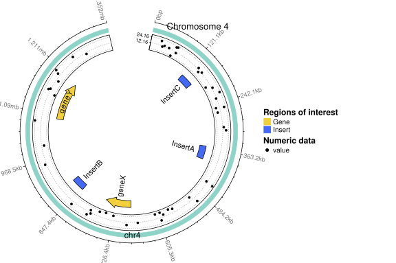

```{r setup, include = FALSE}
library(gmoviz)
library(BiocStyle)
knitr::opts_chunk$set(
  collapse = TRUE,
  comment = "#>"
)
library(knitr)
knitr::opts_chunk$set(fig.width=12, fig.height=8, fig.keep='last',
                      message = FALSE, warning = FALSE)
opts_knit$set(global.par = TRUE)
```

# Introduction 
 

Genetically modified organisms (GMOs) and cell lines are widely used models in 
many aspects of biological research. As part of characterising these models, 
DNA sequencing technology and bioinformatic analyses are used systematically to 
study their genomes. Large volumes of data are generated and various algorithms 
are applied to analyse this data, which introduces a challenge with regards to 
representing all findings in an informative and concise manner. Scientific 
visualisation can be used to facilitate the explanation of complex genomic 
editing events such as intergration events, deletions, insertions, etc. 
However, current visualisation tools tend to focus on numerical data, ignoring 
the need to visualise editing events on a large yet biologically-relevant 
scale. 

`gmoviz` , as implemented in `r CRANpkg("circlize")` [@Gu_2014]. `gmoviz` 
offers the following key features (summarised in the diagram below):

* Visualise complex structural variations, particularly relating to tandem
insertions 

* Generate plots in a single function call, or build them piece by piece for 
finer customisation

* Integration with existing Bioconductor data structures

 

## How to read Circos plots
Circos plots have two key components: sectors and tracks. Each sector 
represents a sequence of interest (such as a chromosome, gene or any other 
region). Tracks on the other hand are used to display data. For example:
```{r sectors-tracks-figure, echo=FALSE, fig.keep='high'}
example_insertion <- GRanges(seqnames = "chr12",
                      ranges = IRanges(start = 70905597, end = 70917885),
                      name = "plasmid", colour = "#7270ea", length = 12000,
                      in_tandem = 11, shape = "forward_arrow")
insertionDiagram(insertion_data = example_insertion, 
                 either_side = c(70855503, 71398284),
                 start_degree = 45, space_between_sectors = 20,
                 xaxis_spacing = 45)
highlight.sector("chr12", col = NA, border = "red", lwd = 1.5)
highlight.sector("plasmid", col = NA, border = "red", lwd = 1.5)


insertionDiagram(insertion_data = example_insertion, 
                 either_side = c(70855503, 71398284),
                 start_degree = 45, space_between_sectors = 20,
                 xaxis_spacing = 45)
draw.sector(start.degree = 0, end.degree = 360,
            0.99, 0.84, border = "blue", lwd = 1.5)
draw.sector(start.degree = 0, end.degree = 360,
            0.84, 0.69, border = "blue", lwd = 1.5)
```
In the figure above, red boxes have been drawn around each of the sectors. In
the next panel, blue boxes have been drawn around each of the tracks

# Installation
`gmoviz` can be installed from [bioconductor.org](http://bioconductor.org/) or
its GitHub repository at _somewhere_

## Bioconductor
To install `gmoviz` via the `BiocManager`, type in R console:
```r
if (!require("BiocManager"))
    install.packages("BiocManager")
BiocManager::install("gmoviz")
```

## GitHub
To install the development version of `gmoviz` from GitHub,
type in the R console: _something_

## R package dependencies
`gmoviz` depends on several packages from the 
[CRAN](https://cran.r-project.org/) and 
[Bioconductor](https://bioconductor.org/) repositories:

* `r CRANpkg("circlize")` provides the lower-level functions used to generate
the circular plots. To install it, type in the R console: 
`install.packages("circlize")`

* `r Biocpkg("GenomicRanges")` and `r Biocpkg("IRanges")` are required for the 
GRanges data structure that is used to store information for plotting. To 
install them, type in the R console: 
```r
if (!require("BiocManager"))
    install.packages("BiocManager")
BiocManager::install(c("GenomicRanges", "IRanges"))
```

* `r CRANpkg("gridBase")` faciliates the use of the circular plots (which are
generated using base graphics) with the grid graphics system. To install it, 
type in the R console:
`install.packages("gridBase")`

* `r Biocpkg("ComplexHeatmap")` is used to generate legends. To install it, 
type in the R console:
```r
if (!require("BiocManager"))
    install.packages("BiocManager")
BiocManager::install("ComplexHeatmap")
```

* `r Biocpkg("Rsamtools")` is used to read information about the sequence
names, lengths and coverage from _.bam_ files. To install it, type in the R 
console: 
```r
if (!require("BiocManager"))
    install.packages("BiocManager")
BiocManager::install("Rsamtools")
```

* `r Biocpkg("Biostrings")` is used to read information about the sequence
names and lengths from _.fasta_ files. To install it, type in the R console: 
```r
if (!require("BiocManager"))
    install.packages("BiocManager")
BiocManager::install("Biostrings")
```

* `r Biocpkg("rtracklayer")` is used to read information on genomic features 
from _.gff_ files. To install it, type in the R console: 
```r
if (!require("BiocManager"))
    install.packages("BiocManager")
BiocManager::install("rtracklayer")
```

* `r CRANpkg("pracma")` is used to apply moving-average smoothing to the 
coverage data. To install it, type in the R console: 
`install.packages("pracma")`

* `r Biocpkg("BiocGenerics")` is used to support the many Bioconductor data
structures and functions used in `gmoviz` To install it, type in the R console: 
```r
if (!require("BiocManager"))
    install.packages("BiocManager")
BiocManager::install("BiocGenerics")
```
* `r Biocpkg("GenomeInfoDb")` and `r Biocpkg("GenomicAlignments")` are used to 
read in the coverage data from _.bam_ files. To install them, type in the 
R console: 
```r
if (!require("BiocManager"))
    install.packages("BiocManager")
BiocManager::install(c("GenomeInfoDb", "GenomicAlignments"))
```

# Quick start
This section will walk through the basic usage of `gmoviz`.

## Higher-level plotting steps {#higher_level}
### Insertion diagram
`insertionDiagram` is the 'star' function of `gmoviz`, designed to make it 
easier to plot (and thus show the copy number of) tandem insertion events. 
It requires only one input: insertion_data (either a GRanges or a data frame)
with the following columns.[^1] :

[^1]: If using a GRanges these should be the metadata columns and each range
should correspond to the start/end of the insertion site. For data frame input,
use the columns `chr`, `start` and `end` to describe the insertion site's
location. 

* **name** A character string indicating the name of the insert. Each insert 
must have a unique name. 

* **colour** A character string of a colour to use. Supports hex colours like
`#000000` and named R colours like `red`

* **shape** The shape that will be used to represent the insert:
  + `rectangle` is a rectangle (the default)
  + `forward_arrow` is a forwards-facing arrow
  + `reverse_arrow` is a backwards (reverse) facing arrow

* **length** The length **of a single copy** of the insert, **in bp**

* **in_tandem** The number of tandem copies of the insert (defaults to 1 if not
supplied)

Note that _in\_tandem_, _shape_ and _colour_ are all optional: if any of
these columns are not supplied the inserts will still be plotted and default
values will be allocated.

`insertionDiagram` will plot the tandem insert(s) on one sector, and use a 
'link' to show the position they have inserted into in their target 
sequence (the other sector).[^2] :

[^2]: A link is a semi-transparent shape which connects two sectors in the
circle. It is very useful for demonstrating insertion events, or to indicate
zooming into a particular part of the sector.

```{r cnd-style1}
example_insertion <- GRanges(seqnames = "chr12",
                      ranges = IRanges(start = 70905597, end = 70917885),
                      name = "plasmid", colour = "#7270ea", length = 12000,
                      in_tandem = 11, shape = "forward_arrow")
insertionDiagram(insertion_data = example_insertion, 
                 space_between_sectors = 20, xaxis_spacing = 45)
```
The above diagram shows the insertion of 11 tandem copies of 'plasmid' at the
site chr12:70905597-70917885. 

#### Alternate styles 
There are four different styles of `insertionDiagram`: above was style 1: the
emphasis was placed on the inserted sequence(s) and a rectangle was drawn for
the inserted sequences to highlight that they are inserted as one long tandem
group.

The same diagram can be plotted with the emphasis on the target sequence
**(style 2)**:
```{r cnd-style2}
insertionDiagram(example_insertion, space_between_sectors = 20, style = 2)
```
Notice how the target sequence (chr12) is now larger than the inserted sequence

Additionally, the rectangle outside of the inserted sequences can be removed,
using styles 3 and 4 (which, like styles 1 and 2 differ only in the relative
sizes of the target and inserted sequences)

Styles 3 & 4 are recommended for single-copy insertions, like the following:
```{r cnd-singleins-style34, fig.keep='high'}
single_copy_insertion <- GRanges(seqnames = "chr12",
                       ranges = IRanges(start = 70905597, end = 70917885),
                       name = "plasmid", length = 12000)
insertionDiagram(single_copy_insertion, space_between_sectors = 20, style = 3)
insertionDiagram(single_copy_insertion, space_between_sectors = 20, style = 4)
```
Notice how we were able to omit the `in_tandem`, `colour` and `shape` columns 
from the insertion data, because we were happy with the default values.

#### Multiple insertion sites
Additionally, the `insertionDiagram` is capable of showing multiple integration
sites. To do this, simply add another row to the insertion data:
```{r cnd-multiple}
multi_insertions <- GRanges(seqnames = "chr12",
                       ranges = IRanges(start = 70910000, end = 70920000),
                       name = "plasmid2", length = 10000)
multiple_insertions <- c(single_copy_insertion, multi_insertions)

## plot it
insertionDiagram(multiple_insertions)
```
Note that adding multiple insertion sites across different chromosomes using
`insertionDiagram` is currently **not** supported; it simply becomes too messy 
and crowded on a single circle. If you are interested in showing many 
insertions throughout the genome, please see the `multipleInsertionDiagram`
function [here](#aobf) which uses many circles to avoid this problem

#### Adding more information {#cnd_more_info}
The `insertionDiagram` function (and also the `featureDiagram` function which 
works in a similar way) is also able to accept two optional inputs: labels 
(for example to indicate genes, exons or other genomic regions of interest) 
and coverage data.[^3] This section will explain how to add this information 
to a plot.

[^3]: more information on adding labels to plots including colour coding and 
reading in label data from file can be found [here](#labels).

Firstly, labels:
```{r cnd-labels}
nearby_genes <- GRanges(seqnames = c("chr12", "chr12"),
                        ranges = IRanges(start = c(70901000, 70911741),
                                         end = c(70910000, 70919000)),
                        label = c("Gene A", "Gene B"))
insertionDiagram(insertion_data = example_insertion, 
                 label_data = nearby_genes,
                 either_side = nearby_genes, 
                 space_between_sectors = 20,
                 xaxis_spacing = 75, # one x axis label per 75 degrees
                 label_size = 0.8, # smaller labels so they fit
                 track_height = 0.1) # smaller shapes so the labels fit
```
The labels for genes A and B have now been plotted on the insertion diagram.
Importantly, we not only supplied our `nearby_genes` GRanges to the 
`label_data` argument, we also used it for `either_side`.[^4] This means that, 
unlike the previous figure which only plotted the area immediately around the 
integration site, this figure extends to cover the genes that we want to 
label. 

Finally, we might like to also plot the coverage around the integration site:
To do this, we need some `coverage_data` which can be read in from a _.bam_ 
file (see [here](#get_coverage) for how to do this), although for now we will 
just use simulated data.

[^4]: Using a GRanges is only one of the ways to set `either_side`. Please see
[here](#either_side) for more information about controlling the amount of 
sequence shown either side of the integration site.

```{r cnd-coverage}
## simulated coverage
coverage <- GRanges(seqnames = rep("chr12", 400),
                    ranges = IRanges(start = seq(from = 70901000, 
                                                 to = 70918955, by = 45),
                                     end = seq(from = 70901045, 
                                               to = 70919000, by = 45)),
                    coverage = c(runif(210, 10, 15), rep(0, 190)))

## plot with coverage
insertionDiagram(insertion_data = example_insertion, 
                 coverage_data = coverage,
                 coverage_rectangle = "chr12",
                 label_data = nearby_genes,
                 either_side = nearby_genes, 
                 space_between_sectors = 20,
                 xaxis_spacing = 75, # one x axis label per 75 degrees
                 label_size = 0.8, # smaller labels so they fit
                 track_height = 0.1) # smaller shapes so the labels fit
```
Notice how the rectangle representing chr12 has been replaced by a line graph
of the coverage. This allows us to see that there has been a deletion of gene 
B in addition to the insertion of 11 tandem copies of the plasmid.

**Note:** As well as supplying the coverage data to the `coverage_data` 
argument, it is vital that you also provide the sector(s) that you want to plot
coverage for to `coverage_rectangle`. 

#### How to set `either_side` {#either_side}
The `either_side` argument of `insertionDiagram` controls how much of the
target sequence is shown either side of the insertion site. It can take four
sorts of values:

* `"default"` takes an extra 15% either side of the insertion site.

* a single number _e.g._ `8000` will take that many bp either side of the 
insertion site

* a vector of length two will set the start and end points for that sector.
This allows you to show the gene(s) or other regions of interest near the
insertion site in full

* a GRanges object can also be used, for example the GRanges used to find the 
coverage over a region with `getCoverageData` or to hold gene labels.

For example:
```{r either_side, fig.keep='high'}
## default
insertionDiagram(example_insertion, start_degree = 45, 
                 space_between_sectors = 20)
## single number
insertionDiagram(example_insertion, either_side = 10000, start_degree = 45,
                 space_between_sectors = 20)
## vector length 2
insertionDiagram(example_insertion, either_side = c(70855503, 71398284),
start_degree = 45, space_between_sectors = 20)
```

### Plotting many insertions throughout the genome {#aobf}
The `multipleInsertionDiagram` is an extension of the `insertionDiagram`. It
displays many (up to 8) insertions throughout the genome by drawing multiple 
`insertionDiagram` figures around a central whole genome circle like so:
```{r aobf_example, echo=FALSE, out.width="1200px", out.height="800px", dev="pdf"}
ideogram_data <- GRanges(
  seqnames = paste0("chr", 1:6), 
  ranges = IRanges(start = rep(0, 6), end = rep(12000, 6)))
insertion_data <- GRanges(
  seqnames = c("chr1", "chr5"),
  ranges = IRanges(start = c(4000, 2000), end = c(4100, 2200)),
  name = c("ins1", "ins5"), length = c(100, 200))
multipleInsertionDiagram(insertion_data = insertion_data,
                         genome_ideogram_data = ideogram_data,
                         colour_set = rich_colours)
```

Here, two insertions (one in chr1 and one in chr5) are depicted as their own
diagrams, connected to the central genome with a 'link'.

Drawing these diagrams is relatively straightforward (and very similar to the
use of `insertionDiagram`) as only two inputs are necessary:

* **_insertion_data_**: Insertion data in the same format as for 
`insertionDiagram`. 

* **genome_ideogram_data**: A GRanges (or data frame) that contains the name, 
start and end of each of the chromosomes in the genome (see 
[here](#get_coverage) for how to import this from file)

For example, to generate the plot shown above:
```{r aobf_basic, out.width="1200px", out.height="800px", dev="pdf"}
ideogram_data <- GRanges(
  seqnames = paste0("chr", 1:6), 
  ranges = IRanges(start = rep(0, 6), end = rep(12000, 6)))
insertion_data <- GRanges(
  seqnames = c("chr1", "chr5"),
  ranges = IRanges(start = c(4000, 2000), end = c(4100, 2200)),
  name = c("ins1", "ins5"), length = c(100, 200))
multipleInsertionDiagram(insertion_data = insertion_data,
                         genome_ideogram_data = ideogram_data,
                         colour_set = rich_colours)
```
One key difference to note about `multipleInsertionDiagram` (as opposed to the
regular `insertionDiagram`) is that rather than specifying colours for the 
sectors and links separately, you are only able to provide one 'set' (vector)
of colours from which the sector and link colours will be assigned. `gmoviz` 
provides 5 sets of colours (more information [here](#colours)) or you can 
supply your own (but note that you **must** have at least 1 colour per row of
`genome_ideogram_data`). Otherwise, save the figure as a vector image and open
it in vector image editing programs to have finer control over the colour of 
each little bit of the diagram.

#### Customising your multiple insertion diagram {#aobf_tweaking}
Just like `insertionDiagram`, `multipleInsertionDiagram` is able to display
more information, like coverage and labels. These work just like for the 
[regular insertion diagram](#cnd_more_info):
```{r aobf_coverage_labels, out.width="1200px", out.height="800px", dev="pdf"}
## example coverage and labels
example_coverage <- GRanges(
seqnames = c(rep("chr1", 100), rep("chr5", 100)),
ranges = IRanges(start = c(seq(3985, 4114, length.out = 100),
                           seq(1970, 2229, length.out = 100)),
                 end = c(seq(3986, 4115, length.out = 100),
                         seq(1971, 2230, length.out = 100))),
                 coverage = c(runif(100, 0, 25), runif(100, 0, 15)))

 example_labels <- GRanges(seqnames = c("chr1", "chr5"),
                           ranges = IRanges(start = c(4000, 2000),
                           end = c(4120, 2200)),
                           label = c("Gene A", "Gene B"),
                           colour = c("red", "blue"))

## plot with coverage and labels
multipleInsertionDiagram(insertion_data = insertion_data,
                         genome_ideogram_data = ideogram_data,
                         coverage_rectangle = c("chr1", "chr5"),
                         coverage_data = example_coverage,
                         label_data = example_labels, 
                         label_colour = example_labels$colour)
```
As shown above, it's perfectly fine to mix the labels and coverage data for 
different insertion events in the same GRanges/data frame. 

For the arguments `either_side` and `style` however, this function differs 
slightly. These can be set overall (by a single value):
```{r aobf_single_val, out.width="1200px", out.height="800px", dev="pdf"}
multipleInsertionDiagram(insertion_data = insertion_data,
                         genome_ideogram_data = ideogram_data,
                         either_side = 1000, style = 2)
```

However, it is usually best (especially for `either_side`) to choose a value
that suits the particular event. This can be done with a named vector (for
`style`) or a named list (for `either_side`):
```{r aobf_es_GRanges, out.width="1200px", out.height="800px", dev="pdf"}
## it's even possible to use GRanges in this way
either_side_GRange <- GRanges("chr5", IRanges(1000, 3200))
multipleInsertionDiagram(insertion_data = insertion_data,
                         genome_ideogram_data = ideogram_data,
                         either_side = list("ins1" = 1000, 
                                            "ins5" = either_side_GRange),
                         style = c("ins1" = 2, "ins5" = 4))
```
**Warning**: When specifying the events for `either_side` and `style` you need
to use the **event names, not the chromosome names** (as there can be more 
than one event per chromosome, but each event must have a unique name)

### Feature diagram {#feature_diagram}
The function `featureDiagram` is more general than `insertionDiagram`; it is 
capable of displaying any 'feature' (a region of interest, for example a gene,
exon or inserted sequence). Each feature is represented as a colour-coded 
shape, the exact nature of which is specified by the `feature_data` (see below
for details). The following examples highlight the diverse range of figures 
that can be plotted with `featureDiagram`:

#### Plasmid map
The circos plots generated by `gmoviz` are a great way to plot circular 
sequences like plasmids. In this example, we will generate a plasmid map.
Firstly, we need two key inputs: 

* the `ideogram_data` (a GRanges describing the name, start and end positions 
    of the plasmid).[^5]

* the `feature_data` (a GRanges or describing at least the location of each
    feature, and optionally specifying a label, shape, colour and track with 
    which to plot). A detailed description of the format of `feature_data` can 
    be found [here](#features), but for now we will just use the defaults that
    are assigned by the `getFeatures` when reading in features from a .gff
    file

[^5]: More details about `ideogram_data` including how to specify it using 
a data frame rather than a GRanges can be found [here](#initialisation)
    
```{r fdd-plasmid}
## the data
plasmid_ideogram <- GRanges("plasmid", IRanges(start = 0, end = 3000))
plasmid_features <- getFeatures(
  gff_file = system.file("extdata", "plasmid.gff3", package="gmoviz"),
  colour_by_type = FALSE, # colour by name rather than type of feature
  colours = rich_colours) # choose colours from rich_colours (see ?colourSets)

## the plot
## plot plasmid map with coverage
featureDiagram(plasmid_ideogram, plasmid_features, track_height = 0.17,
               label_track_height = 0.11, 
               space_between_sectors = 0, # continuous circle
               xaxis_spacing = 30, # x axis label every 30 degrees
               start_degree = 90) # start from 90 degrees (12 o'clock)
```
Another great addition to the plasmid map is the coverage data, which can show 
us which part(s) of the plasmid were inserted into the target genome. As 
before, we will use simulated coverage data:

```{r plasmid-map-coverage}
## make some simulated coverage data
coverage <- GRanges(seqnames = rep("plasmid", 200),
                    ranges = IRanges(start = seq(from = 0, to = 2985, by = 15),
                                     end = seq(from = 15, to = 3000, by = 15)),
                    coverage = c(runif(110, 10, 15), rep(0, 90)))
## plot plasmid map with coverage
featureDiagram(plasmid_ideogram, plasmid_features, track_height = 0.17,
               coverage_rectangle = "plasmid", # don't forget this!
               coverage_data = coverage, 
               label_track_height = 0.11, space_between_sectors = 0, 
               xaxis_spacing = 30, start_degree = 90)
```
As we can see, there is relatively uniform coverage on the first half of the 
plasmid, whilst there is none for the second half. This suggests that our 
promoter, gene and GFP have been inserted, but the ampR and rest of the plasmid
sequence have not.

#### Insertion of a complex construct {#complex_features}
While `insertionDiagram` is great for showing the copy number in tandem 
insertions, `featureDiagram` is better for displaying the insertion of 
complex constructs. In this example, we will draw a complex gene editing 
design, in which one sector will display the inserted construct and the other 
sector will be the target sequence. 

Firstly, we will read in the necessary data: the ideogram_data, exon_label (a
label indicating the exon that will be targeted by the gene editing event) and
of course the feature_data.

```{r fdd-complex-construct-data}
## the data
complex_ideogram <- GRanges(seqnames = c("Gene X", "Template"),
                            ranges = IRanges(start = c(5000, 0), 
                                             end = c(6305, 3788)))
## exon label
exon_label <- GRanges("Gene X", IRanges(5500, 5960), label = "Exon 2")
  
## features
complex_features <- getFeatures(
  gff_file = system.file("extdata", "complex_insertion.gff3", 
                         package="gmoviz"),
  colours = rich_colours)
```

Before we plot, we will make a few changes to the `complex_features` GRanges:
by default the `getFeatures` function will only assign features to 'track 1'
(the track that is closest to the outside of the circle) and shapes will be 
either arrows (for genes) or rectangles (for other features).[^6]

[^6]: Again, this is described in detail in the [features](#features) section.

In this case, it will look better if our cut sites are drawn as triangles and 
are set slightly away from the remaining features on the second track:
```{r fdd-complex-construct-plot}
## make a few edits to the feature_data: 
complex_features$track[c(3,4)] <- 2 # cut sites on the next track in
complex_features$shape[c(3,4)] <- "upwards_triangle" # triangles 

## plot the diagram
featureDiagram(ideogram_data = complex_ideogram, 
               feature_data = complex_features, 
               label_data = exon_label, custom_sector_width = c(0.6, 0.4),
               sector_colours = c("#6fc194", "#84c6d6"),
               sector_border_colours = c("#599c77", "#84c6d6"),
               space_between_sectors = 25, start_degree = 184, 
               label_size = 1.1)
```

As for `insertionDiagram` it is possible to add both labels and coverage data
to a graphic produced with `featureDiagram`. However, `featureDiagram` also 
accepts one other optional input: the `link_data`. This can be used to draw a
link (like the one used to show the integration event in `insertionDiagram`)
but in this case the link can be positioned wherever you desire. 

To make the fact that the template is inserted into gene X a bit clearer, we
can use a **link**. To draw a link, we need to supply a `data.frame`
containing the link information. It should have **2 rows**, one for each end of
the link.[^7] For example, the following link goes from 5600-5706bp on gene X 
to 0-3788bp on the template.


```{r fdd-link, fig.height = 8.23, fig.width = 11.69}
# link data
link <- data.frame(chr = c("Gene X", "Template"),
                   start = c(5600, 0),
                   end = c(5706, 3788))
featureDiagram(ideogram_data = complex_ideogram, 
               feature_data = complex_features, label_data = exon_label, 
               custom_sector_width = c(0.6, 0.4),
               sector_colours = c("#6fc194", "#84c6d6"),
               sector_border_colours = c("#599c77", "#84c6d6"),
               space_between_sectors = 25, start_degree = 184, 
               label_size = 1.1, link_data = link)
```
This clearly indicates that connection between the template and gene X sectors.

[^7]: Note that this same method can be used to add links to any `gmoviz` plot
using the `circlize` functions `circos.link` and `circos.genomicLink`. 
For more information on how to use `circlize` functions to further customise 
`gmoviz` plots, please see [here](#using_circlize).

# Manual plotting steps {#manual_plotting}
As well as [high-level functions](#higher_level) functions, `gmoviz` contains
many lower-level functions that can be used to construct a plot track-by-track 
for more flexibility.

## Dataset
This section will use the `rBiocpkg("pasillaBamSubset")` package for example
data, so please ensure you have it installed before proceeding:
```{r get-pasilla-bams}
if (!require("pasillaBamSubset")) {
    if (!require("BiocManager"))
        install.packages("BiocManager")
    BiocManager::install("GenomicAlignments")
}
library(pasillaBamSubset)
```

## Initialisation & Ideograms {#initialisation}
The first step in creating a circular plot is to initialise it. This involves
creating the ideogram (the rectangles that represent each sequence), which lays
out the sectors for data to be plotted into. To do this, we need some 
**ideogram data**, in one of the following formats:

* A `GRanges`, with one range for each sector you'd like to plot.
* A `data.frame`, with three columns: `chr` (sector's name), `start` and
    `end`.

For example, the following two ideogram data are equivalent:
```{r two-types-of-ideo, fig.keep='high'}
ideogram_1 <- GRanges(seqnames = c("chrA", "chrB", "chrC"),
                 ranges = IRanges(start = rep(0, 3), end = rep(1000, 3)))
ideogram_2 <- data.frame(chr = c("chrA", "chrB", "chrC"), 
                    start = rep(0, 3),
                    end = rep(1000, 3))  
gmovizInitialise(ideogram_1)
gmovizInitialise(ideogram_2)
```
Both of the higher level functions `featureDiagram` and `insertionDiagram` do
this as their first step.

### Reading in the ideogram data {#get_ideogram}
Of course, typing this manually each time is troublesome. `gmoviz` provides the
function `getIdeogramData` which creates a `GRanges` of the ideogram data
from either a _.bam_ file, single _.fasta_ file or a folder containing many 
_.fasta_ files.[^8] This function can be used as follows:

[^8]: Note that reading in from a _.bam_ file is significantly faster than from
a _.fasta_ file.
```{r getIdeogramData}
## from a .bam file
fly_ideogram <- getIdeogramData(bam_file = pasillaBamSubset::untreated3_chr4())

## from a single .fasta file
fly_ideogram_chr4_only <- getIdeogramData(
  fasta_file = pasillaBamSubset::dm3_chr4())
```

But what if we wanted to read in just the chr3L? Luckily `getIdeogramData` has
filters to select the specific sequences you want.

#### Filtering ideogram data {#get_ideogram_filters}
When reading in the ideogram data from file, there are often sequences in the 
_.bam_ file or _.fasta_ file folder that are not necessary for the plot. Thus,
the `getIdeogramData` function provides three filters to allow you to only
read in the sequences you want.[^9]

[^9]: These filters only work on the `bam_file` and `fasta_folder` input 
methods. Using a `fasta_file` means that filtering is not possible (although
you can of course edit the ideogram GRanges after it is generated).

If we want only a single chromosome/sequence, we can supply it to 
`wanted_chr`:
```{r getIdeogramData-wanted_chr}
getIdeogramData(bam_file = pasillaBamSubset::untreated3_chr4(),
                wanted_chr = "chr4")
```

Alternatively, if we want all chromosomes/sequences expect one, we can supply 
it to `unwanted_chr`:
```{r getIdeogramData-unwanted_chr}
getIdeogramData(bam_file = pasillaBamSubset::untreated3_chr4(),
                unwanted_chr = "chrM")
```

Finally, you can supply any regex pattern to `just_pattern` to create your own
custom filter:
```{r getIdeogramData-just_pattern}
getIdeogramData(bam_file = pasillaBamSubset::untreated3_chr4(),
                just_pattern = "R$")
```

Of course, for these filters to work the spelling of the filter must exactly
match the spelling of the _.fasta_ file names or the sequences in the _.bam_
file.

### Initialising the graph
Now that we have the ideogram data, we can initialise the graph. For this 
example, we will just focus on chromosome 4. 
```{r gmovizInitialise}
gmovizInitialise(fly_ideogram_chr4_only, track_height = 0.15)
```

We can see that a rectangle has been plotted and labelled to indicate chr4.
Changing a few visual settings, we can create a better looking ideogram:
```{r gmovizInitialise-pretty}
gmovizInitialise(fly_ideogram_chr4_only, 
                 space_between_sectors = 25, # bigger space between start & end 
                 start_degree = 78, # rotate the circle
                 sector_label_size = 1, # bigger label
                 track_height = 0.15, # thicker rectangle
                 xaxis_spacing = 30) # label every 30 degrees on the x axis
```

However, these small tweaks are not the only way we can enhance the appearance
of our plot. `gmovizInitialise` can also display 
[coverage data](#coverage_rectangles) and [labels](#labels), as well as
supporting [zooming and alteration of sector widths](#changing_sector_widths).

#### 'Coverage rectangles' {#coverage_rectangles}
As demonstrated with the `insertionDiagram` and `featureDiagram` functions, we
can supply some `coverage_data` to enhance the ideogram and change the regular
rectangles into line graphs which display the coverage ('coverage 
rectangles'). This then allows the easy identification of deletions, 
duplications and other events which alter the coverage.

##### Reading in coverage data {#get_coverage}
To do this, we must first read in the coverage information from the _.bam_ 
file. This can be done with the `getCoverage` function:
```{r getCoverage}
chr4_coverage <- getCoverage(
  regions_of_interest = "chr4", 
  bam_file = pasillaBamSubset::untreated3_chr4(),
  window_size = 350, smoothing_window_size = 400)
```

Here, we get the smoothed and windowed coverage for chr4.[^10] As we wanted the
coverage for the entire chr4, we could simply make 
`regions_of_interest = "chr4"`. However, we could also have supplied a GRanges
describing that area instead. Whichever input is used, it is really important 
that the sequence names match **exactly**. For example, the following will t
hrow an error, because there is no sequence named "4" or "Chr4" in the _.bam_ 
file:
```{r getCoverage-error, error = TRUE, purl = FALSE}
getCoverage(regions_of_interest = "4", 
            bam_file = pasillaBamSubset::untreated3_chr4(),
            window_size = 300, smoothing_window_size = 400)
getCoverage(regions_of_interest = "Chr4", 
            bam_file = pasillaBamSubset::untreated3_chr4(),
            window_size = 300, smoothing_window_size = 400)
```
[^10]: See below the section on [smoothing and windowing](#smooth_window) 
for the effect of each of these arguments

##### Plotting coverage {#plotting_coverage}
Now that we have the coverage data, we can plot the ideogram again using this
information. To draw a 'coverage rectangle' we need to firstly specifiy the 
`coverage_data` to be used (as either a GRanges or a data frame) and then also 
supply to `coverage_rectangle` a vector of the sector names to plot the 
coverage data for.[^11]

[^11]: This means that you can have the coverage of multiple sequences/regions
in the same GRanges but choose to plot only some of them.

```{r gmovizInitialise-covRect}
gmovizInitialise(ideogram_data = fly_ideogram_chr4_only, 
                 coverage_rectangle = "chr4", 
                 coverage_data = chr4_coverage,
                 xaxis_spacing = 30) 
```
As you can see, the chr4 ideogram rectangle is replaced with a line graph 
showing the coverage over the entire chromosome. The coloured area represents 
the coverage, allowing easy identification of high and low coverage areas. 


##### Smoothing and windowing coverage data {#smooth_window}
When reading in the coverage data, there are two additional parameters
`window_size` and `smoothing_window_size` that modify the values. 

* `window_size` controls the window size over which coverage is calculated 
(where a window size of 1 is per base coverage. A larger window size will 
reduce the time taken to read in, smooth and plot the coverage. It will also 
remove some of the variation in the coverage, although this is not its primary 
aim. If you have more than 10-15,000 points, it is **highly recommended** to 
use a larger window size, as this will take a long time to plot.

* `smoothing_window_size` controls the window used for moving average 
smoothing, as carried out by the `r CRANpkg("pracma")` package. It **does not** 
reduce the number of points and so offers **no speed improvement** (in fact, it 
increases the time taken to read in the coverage data). It does, however, 
reduce the variation to produce a smoother, more attractive plot.

For example, try running the following:
```{r getCoverage-window_size, eval = FALSE}
# default window size (per base coverage)
system.time({getCoverage(regions_of_interest = "chr4", 
                         bam_file = pasillaBamSubset::untreated3_chr4())})

# window size 100
system.time({getCoverage(regions_of_interest = "chr4", 
                         bam_file = pasillaBamSubset::untreated3_chr4(),
                         window_size = 100)})

# window size 500
system.time({getCoverage(regions_of_interest = "chr4", 
                         bam_file = pasillaBamSubset::untreated3_chr4(),
                         window_size = 500)})


```
Notice how going from the default window size of 1 (per base coverage) to a
relatively modest window size of 100 dramatically reduces the time needed to 
read in the coverage data. 

In terms of the appearance of the plot:
(**note:** for speed, we will plot only a subset of the chromosome: from 
70000-72000bp)
```{r smoothing-windowing}
# without smoothing
chr4_region <- GRanges("chr4", IRanges(70000, 72000))
chr4_region_coverage <- getCoverage(regions_of_interest = chr4_region,
                          bam_file = pasillaBamSubset::untreated3_chr4())
gmovizInitialise(ideogram_data = chr4_region, coverage_rectangle = "chr4", 
                 coverage_data = chr4_region_coverage, custom_ylim = c(0,4))

# with moderate smoothing 
chr4_region_coverage <- getCoverage(regions_of_interest = chr4_region,
                          bam_file = pasillaBamSubset::untreated3_chr4(),
                          smoothing_window_size = 10)
gmovizInitialise(ideogram_data = chr4_region, coverage_rectangle = "chr4", 
                 coverage_data = chr4_region_coverage, custom_ylim = c(0,4))

# with strong smoothing
chr4_region_coverage <- getCoverage(regions_of_interest = chr4_region,
                          bam_file = pasillaBamSubset::untreated3_chr4(),
                          smoothing_window_size = 75)
gmovizInitialise(ideogram_data = chr4_region, coverage_rectangle = "chr4", 
                 coverage_data = chr4_region_coverage, custom_ylim = c(0,4))
```
Notice how adding smoothing dramatically improves the appearance of the plot.
It also slightly reduces the time taken, because there are less extreme points.
However, it does result in the loss of the finer detail of the coverage data.
Thus, it is recommended that you play around with the values of 
`smoothing_window_size` and `window_size` and choose a value that is best 
suited to your own data.

#### Adding labels {#labels}
One more functionality of `gmovizInitialise` is the ability to add labels to 
the outside of the plot. These can be used to identify regions of interest, 
such as genes or exons. The format of this should be:

* A `GRanges`, with one range for each label & the label's text as a metadata
column `label`

* A `data.frame`, with columns: `chr` (sector's name), `start` and `end`
that represent the position of the label and `label` that contains the label's
text

For example:
```{r gmovizInitialise-labels}
label <- GRanges(seqnames = "chr4", 
                 ranges = IRanges(start = 240000, end = 280000),
                 label = "region A")
gmovizInitialise(fly_ideogram_chr4_only, label_data = label, 
                 space_between_sectors = 25, start_degree = 78, 
                 sector_label_size = 1, xaxis_spacing = 30)
```
This is the same as how the labels in `insertionDiagram` and `featureDiagram`
are implemented.

These labels can be manually specified as above, or read in from a .gff file,
which also gives the option of colour coding the labels.[^12] :

[^12]: This works simply by supplying a vector of colours (with the same length
as the number of labels) to `label_colour` rather than just a single colour. 
You don't have to have the colours as a part of the label data, it's just a
bit easier to keep track of that way.

```{r labels-from-gff}
labels_from_file <- getLabels(
  gff_file = system.file("extdata", "example.gff3", package = "gmoviz"),
  colour_code = TRUE)
gmovizInitialise(fly_ideogram_chr4_only, 
                 label_data = labels_from_file, 
                 label_colour = labels_from_file$colour,
                 space_between_sectors = 25, start_degree = 78, 
                 sector_label_size = 1, xaxis_spacing = 30)  
```
#### Changing sector sizes {#changing_sector_widths}
By default, when using `gmovizInitialise`, each sector is sized to match its 
length relative to all of the other sectors on the plot to faciliate accurate 
representation of the scale. However, when a plot includes sectors that differ
greatly in size, this can lead to problems. For example:

```{r zooming-ideo}
fly_ideogram <- getIdeogramData(bam_file = pasillaBamSubset::untreated3_chr4(),
                                unwanted_chr = "chrM")
gmovizInitialise(fly_ideogram)
```
Notice that chr4 and chrYHet are much shorter than the other chromosomes.
Thus, when we try to plot it, those three shorter sectors are so small that 
they are barely visible and their labels overlap leading to confusion.

We can deal with this in one of two ways: firstly by manually specifying the
width (size) of each sector and secondly by zooming.

##### Setting custom sector widths
One way to manipulate the width/size of the sectors is to specify a 
`custom_sector_width` (custom sector width) vector. This vector should be the 
same length as the number of sectors. For example:
```{r gmovizInitialise-custom_sector_width}
gmovizInitialise(fly_ideogram, 
                 custom_sector_width = c(0.2, 0.2, 0.2, 0.2, 0.2, 0.1, 0.1))
```
Notice that the `custom_sector_width` vector had length 7, because this is how 
many sectors there are. 

`custom_sector_width` can also be used for the `insertionDiagram` and
`featureDiagram` functions. For example:
```{r cnd-custom_sector_width}
# default
insertionDiagram(example_insertion, either_side = c(70855503, 71398284),
start_degree = 45, space_between_sectors = 20)

# custom_sector_width
insertionDiagram(example_insertion, either_side = c(70855503, 71398284),
                 start_degree = 45, space_between_sectors = 20, 
                 custom_sector_width = c(0.5, 0.5))
```

##### Zooming {#zooming}
Whilst it is quite easy to set custom sector widths when there are only a few
sectors, it can be quite troublesome for entire genomes. Also, using this 
method loses the relative sizing of all sectors, potentially leading to 
misinterpretation.

We can solve this problem by using the zooming functionality of 
`gmovizInitialise`. Doing this is relatively easy, all we need to do is 
supply the names of sector(s) to zoom to the `zoom_sectors` argument:
```{r gmovizInitialise-zooming-after}
gmovizInitialise(fly_ideogram, zoom_sectors = c("chr4", "chrYHet"),
                 zoom_prefix = "z_") -> t
```
Now, chr4 and chrYHet are clearly visible alongside the rest of the sectors.
Notice that chrYHet is still around 1/4 of the size of chr4, as is expected
from their relative sizes (347038bp and 1351857bp, respectively). Also, all of
the other chromosomes are still proportional. Another advantage of using the
zooming is that the `zoom_prefix` applied to the start of the zoomed sector 
label makes it clear which sectors have been zoomed and which have not.

## Adding tracks {#tracks}
After initialising the graph, the next step is to add tracks containing data.
The two main types of track are the [feature track](#feature_track) and the 
[numeric tracks](#numeric_tracks), which can be combined as desired to create
a customised plot.

### Feature track {#feature_track}
The 'feature' track, plots regions of interest just like the 
[featureDiagram](#feature_diagram) function (in fact, `featureDiagram` is just 
a convenient combination of `gmovizInitialise` and `drawFeatureTrack`). If you 
only want to plot features, then using `featureDiagram` is probably easier, but
taking a track-by-track approach with `drawFeatureTrack` allows the combination 
of feature tracks with numeric data (see [here](#scatterplot_track) for an 
example). 

Just like the `featureDiagram`, `drawFeatureTrack` requires feature data. This 
should be a GRanges (or data frame including the `chr`, `start` & `end` columns
as previously discussed) with the following columns:

* **label** A character string which will be used to label the feature. If 
possible this should be relatively short due to the limited space within the
circle. See [here](#feature_labels) for a detailed discussion of the labelling 
of features.

* **colour** A character string of a colour to use. Supports hex colours like
`#000000` and named R colours like `red`

* **shape** The shape that will be used to represent the feature:
    + `rectangle` is a rectangle (the default)
    + `forward_arrow` is a forwards-facing arrow
    + `reverse_arrow` is a backwards (reverse) facing arrow
    + `upwards_triangle` is a triangle pointing up (out of the circle)
    + `downwards_triangle` is a triangle pointing down (into the circle)
It is recommended to use `forward_arrow` and `reverse_arrow` for features on 
the + and - strands, respectively. `rectangle` is the default, and recommended 
for features that are not stranded.

* **track** The index of the track on which to plot the feature
    + `0` represents the outermost track, where the ideogram rectangles are
    plotted
    + `1` is the default track: one track in from the ideogram
    + `2` and `3` and so on are further into the centre of the circle
Please try to keep the number of tracks below 3 if possible, otherwise there 
may not be enough space in the circle for all of them.

Note that _track_, _shape_, _colour_ and _label_ are all optional: if any of
these columns are not supplied the features will still be plotted and default
values will be allocated.

#### Reading in the feature data
Feature data can be read in from a _.gff_ file using the `getFeatures` 
function. 

```{r getFeatures}
features <- getFeatures(
  gff_file = system.file("extdata", "example.gff3", package = "gmoviz"), 
  colours = rich_colours)
```
Here, we have set the `colours` parameter to `rich_colours`, one of the five
colour sets provided by `gmoviz` (see [here](#colours) for a description of 
each colour set) This means that the features will be allocated a colour from 
this set based on the 'type' field of the _.gff_ file.

Once the feature data is read in, it is highly recommended to take a look and
tweak it, if necessary.

#### Adding a feature track
Once we have the feature data, we can add a feature track to our plot. As we 
are only adding one track, increasing `track_height` to 0.18 gives us a bit 
more room to draw the features.
```{r drawFeatureTrack}
## remember to initialise first
gmovizInitialise(fly_ideogram_chr4_only, space_between_sectors = 25, 
                 start_degree = 78, xaxis_spacing = 30, sector_label_size = 1)
drawFeatureTrack(features, feature_label_cutoff = 80000, track_height = 0.18)
```
Notice that the _geneY_ label was drawn inside the arrow whilst the others were
drawn further into the circle. This is because we set `feature_label_cutoff` to
80000, so any features less than 80000bp long have their labels drawn outside,
so that the label isn't hanging off the end of the feature. See below for a 
detailed discussion of this concept.

#### Label plotting and cutoffs for features {#feature_labels}
When using the `featureDiagram` and `drawFeatureTrack` functions, you
may have noticed that the position of the labels changes based on the size of 
the feature being plotted. For example, in the following plot, the second 'ins'
label is drawn outside the feature, further towards the centre of the circle.
This is because the size of the feature is less than the 
`feature_label_cutoff`.
```{r feature-labels}
featureDiagram(plasmid_ideogram, plasmid_features, track_height = 0.17)
```

Of course, you can specify your own cutoff. At 1, all labels will be plotted 
inside their respective features. 
```{r label cutoff}
## smallest label cutoff
featureDiagram(plasmid_ideogram, plasmid_features, track_height = 0.17,
               feature_label_cutoff = 1)
```


### Numeric data tracks {#numeric_tracks}
As well as the feature track, `gmoviz` also contains more traditional numeric
data tracks: the scatterplot and the line graph. 

To showcase these tracks, we will generate some example data:
```{r numeric_data}
numeric_data <- GRanges(seqnames = rep("chr4", 50),
                       ranges = IRanges(start = sample(0:1320000, 50),
                                        width = 1),
                       value = runif(50, 0, 25))
```

#### Scatterplot track {#scatterplot_track}
Scatterplot tracks can be plotted with `drawScatterplotTrack`:
```{r drawScatterplotTrack}
# remember to initialise first
gmovizInitialise(fly_ideogram_chr4_only, 
                 space_between_sectors = 25, start_degree = 78, 
                 sector_label_size = 1, xaxis_spacing = 30)
drawScatterplotTrack(numeric_data)
```

Of course, you can combine the feature and scatterplot tracks:
```{r drawScatterplotTrack-with-features}
gmovizInitialise(fly_ideogram_chr4_only, space_between_sectors = 25, 
                 start_degree = 78, xaxis_spacing = 30,
                 sector_label_size = 1)
drawScatterplotTrack(numeric_data, gridline_colour = NULL, 
                     track_border_colour = "#000000")
drawFeatureTrack(features, feature_label_cutoff = 80000,
                 track_height = 0.15)
```

It is also possible to colour the points according to a cutoff:
Colour-coding points can help to make it easier to see their values at a 
glance. For example, copy number variation can be depicted with a scatterplot, 
and the colours of the points themselves can represent gains and losses. To 
achieve this, simply set `point_bicolour_cutoff` to the numeric value that you 
want to set as the threshold:
```{r point_bicolour_cutoff}
numeric_data <- GRanges(seqnames = rep("chr4", 100),
                       ranges = IRanges(start = sample(0:1320000, 100),
                                        width = 1),
                       value = runif(100, -2, 5))
gmovizInitialise(fly_ideogram_chr4_only, space_between_sectors = 25, 
                 start_degree = 78, sector_label_size = 1, xaxis_spacing = 30)
drawScatterplotTrack(numeric_data, point_bicolour_cutoff = 2, 
                     point_colour = c("red", "blue"),
                     point_outline_colour = c("black", "black"))
```

#### Line graph track
The line graph function works in much the same way as the scatterplot one:
```{r drawLinegraphTrack}
gmovizInitialise(fly_ideogram_chr4_only, space_between_sectors = 25, 
                 start_degree = 78, xaxis_spacing = 30,
                 sector_label_size = 1)
drawLinegraphTrack(sort(numeric_data), gridline_colour = NULL, 
                   track_border_colour = "#000000")
drawFeatureTrack(features, feature_label_cutoff = 80000,
                 track_height = 0.15)
```

## Finishing touches {#finishing_touches}
### Legends {#legends}
Like `r CRANpkg("circlize")`, `gmoviz` relies on the package 
`r Biocpkg("ComplexHeatmap")` [@Gu_2016] to generate its legends. More 
information about how this works can be found 
[here](https://jokergoo.github.io/circlize_book/book/legends.html), but for 
simplicity, `gmoviz` provides the `makeLegends` function to create legend 
objects without requiring an understanding of how the `ComplexHeatmap` package 
works. 

Here, we will make a legend for the following plot:
```{r plot-for-legend}
gmovizInitialise(fly_ideogram_chr4_only, space_between_sectors = 25, 
                 start_degree = 78, xaxis_spacing = 30, sector_label_size = 1)
drawScatterplotTrack(numeric_data, gridline_colour = NULL, 
                     track_border_colour = "#000000")
drawFeatureTrack(features[1:2, ], feature_label_cutoff = 80000,
                 track_height = 0.15)
```

```{r makeLegends}
legend <- makeLegends(feature_legend = TRUE, feature_data = features[1:2, ],
                   feature_legend_title = "Regions of interest",
                   scatterplot_legend = TRUE, 
                   scatterplot_legend_title = "Numerical data",
                   scatterplot_legend_labels = "value")
```

`legend` is a legend object that can be plotted alongside a circos plot using
the `gmovizPlot` function:

### Arranging legends alongside plots {#arranging}
As explained [here](https://jokergoo.github.io/circlize_book/book/legends.html)
the legends of `ComplexHeatmap` are generated using grid graphics whilst the 
circular plots of `circlize` use base graphics. Thus, combining the two 
requires the use of the `r CRANpkg("gridBase")` package. More information can 
be found at the aforementioned link, but `gmoviz` provides the `gmovizPlot` 
function to conveniently combine these two elements. 

The `gmovizPlot` function generates a plot based on the code supplied to the 
`plotting_functions` parameter and saves it as an image, alongside and optional 
title and legend. [^13]

[^13]: The legend object can be either one generated using `makeLegends` or 
directly made using the functionality of the `ComplexHeatmap` package.

```{r gmovizPlot}
gmovizPlot(file_name = "example.svg", file_type = "svg", 
           plotting_functions = {
    gmovizInitialise(fly_ideogram_chr4_only, space_between_sectors = 25,
                     start_degree = 78, xaxis_spacing = 30)
    drawScatterplotTrack(numeric_data, gridline_colour = NULL, 
                         track_border_colour = "#000000")
    drawFeatureTrack(features[1:2, ], feature_label_cutoff = 80000,
                     track_height = 0.15)
}, legends = legend, title = "Chromosome 4", background_colour = "white",
height = 130, width = 240)
```



`gmovizPlot` also supports .svg and .ps outputs, as well as .png. Using a 
vectorised output (.svg or .ps) is recommended as it allows you to easily edit 
the plot in Illustrator or similar software.

# Miscellaneous details
## `gmoviz` colour sets {#colours}
Often 20+ sectors will be plotted during the initialisation of an entire 
genome. Thus, `gmoviz` includes five different colour sets each containing 34 
colours in order to make it easier to give each of these sectors a unique, 
beautiful colour. Many of the colours in these sets are from or are heavily 
inspired by 
[colorBrewer](http://colorbrewer2.org/#type=sequential&scheme=BuGn&n=3). 
The colour sets are:

* `nice_colours`: The default colour set. Medium brightness, light colours 
designed for use on a white background.

* `pastel_colours`: A set of subdued/pastel colours (a less saturated version 
of the `nice_colours` set), designed for use on a white backgorund.

* `rich_colours`: A set of bright, vibrant colours (though not neon, like the 
`bright_colours_transparent`) designed for use on both white and black 
backgrounds.

* `bright_colours_transparent`: A set of very bright/neon colours 
**with slight transparency** designed for use on a black background. 

* `bright_colours_opaque`: A set of very bright/neon colours 
**without transparency** designed for use on a black background. 

Using `bright_colours_transparent` as the fill and `bright_colours_opaque` as 
the outline gives a nice effect on black backgrounds.

## Adding to plots using circlize functions
As mentioned, `gmoviz` is based on the `r CRANpkg("circlize")` [@Gu_2014] 
package by Zuguang Gu. Thus, `circlize` functions can be used alongside those 
from `gmoviz` to further customise plots. 

Internally, `gmoviz` calls `circos.clear()` **when initialising plots** (at the 
beginning of the `gmovizInitialise`, `featureDiagram` and `insertionDiagram` 
functions) not at the end of functions. This means that, after you have run a 
`gmoviz` plotting function, you can use any `circlize` function to make 
further additions to the plot. 
For example, we can add more text to annotate the `featureDiagram` plot we
created [here](#complex_features):
```{r circlize-annotate-text}
featureDiagram(ideogram_data = complex_ideogram, 
               feature_data = complex_features, 
               label_data = exon_label, custom_sector_width = c(0.6, 0.4),
               sector_colours = c("#6fc194", "#84c6d6"),
               sector_border_colours = c("#599c77", "#84c6d6"),
               space_between_sectors = 25, start_degree = 184, 
               label_size = 1.1, link_data = link)
circos.text(x = 6000, y = 0.5, sector.index = "Gene X", track.index = 3, 
            facing = "bending.inside", labels = "on chrY")
```
Notice the new label on the ideogram, indicating which chromosome gene X
belongs to.

We can also add a highlight to draw attention to a particular region of a plot:
```{r circlize-annotate-rect}
insertionDiagram(example_insertion, either_side = c(70855503, 71398284),
                 start_degree = 45, space_between_sectors = 20)
circos.rect(xleft = 0, xright = 12000, ytop = 1, ybottom = 0, 
            track.index = 2, sector.index = "plasmid", border = "red")
```
Notice the red box drawn around the first copy of the insert.

For more information about using `circlize`, see the comprehensive book
[here](https://jokergoo.github.io/circlize_book/book/)

**Warning:** this also means that if you want to use `circlize` to generate a 
new plot after using `gmoviz`, you will need to use `circos.clear()` to reset.

# Appendices
## Session Info
This vignette was rendered in the following environment:
```{r gmoviz_session_info, echo = FALSE}
sessionInfo()
```
## References
